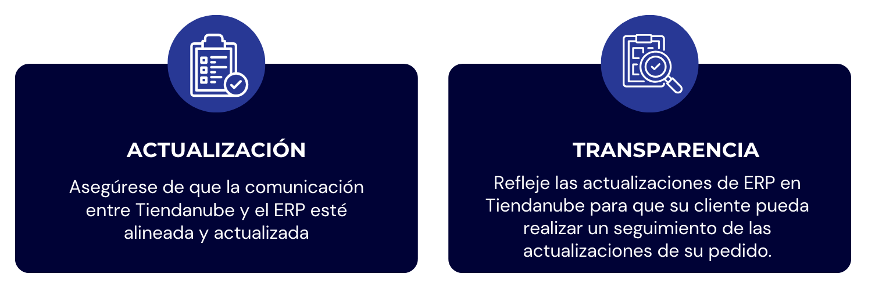
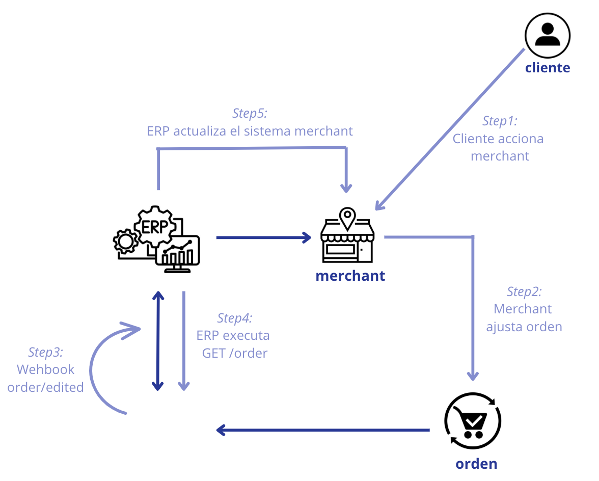
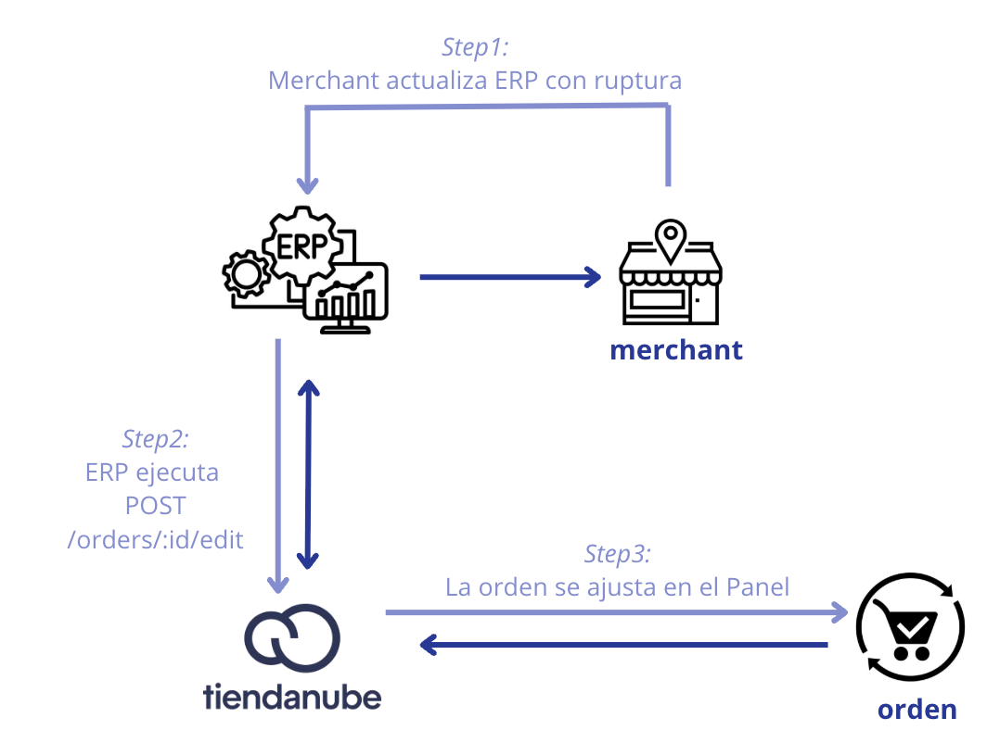

**🔹Guía de partners \- EditOrders**

El objetivo de este documento es orientar y asistir a los merchants y a sus partners en el flujo de **EditOrders**, disponible a través de Tiendanube, para los escenarios en los que sea necesario realizar cambios en los pedidos.

En este proceso, es fundamental garantizar la **consistencia**, la **actualización continua** y un **mapeo preciso de los cambios**. Esto es especialmente relevante para los merchants que utilizan la integración entre un **ERP** y **Tiendanube**.

📌**Importante:** Al se generar un cambio a nivel order de los productos, Tiendanube volve a cotizar el envío, lo que hace que sus valores cambien. Con esto, es importante también que las aplicaciones de envío que ofrezcan servicios pre-pagos, Fulfillment services o colecta, escuchen este webhook, por que cambia información relevante para su gestión.

⚠️ Atención: este proceso de edición de pedido sólo puede ocurrir cuando el pedido aún no ha sido empaquetado (El status de la Fulfillment order se encuentra como `UNPACKED`).  
Vale destacar que las órdenes packed pueden volverse a unpacked desde el administrador de la tienda, mientras que el order dispatched ya no permite volver a unpacked.

Tiendanube se comunica con cualquier cambio en la información del pedido a través de [webhooks](https://tiendanube.github.io/api-documentation/resources/webhook), lo que garantiza una rápida sincronización de datos.  
Con esto, en todos los cambios, Tiendanube envía el webhook `order/edited`, siendo disparados estos cambios también el webhook `order/updated`.

- **Gestión de productos en FFO:**   
  - Ahora se podrá agregar o eliminar productos de un FFO existente. Esta acción activará un nuevo cálculo de los costos de envío.  
- **Restricción de eliminación de FFO:**   
  - Para mantener la integridad del pedido, no se podrá eliminar los FFO de la orden, ya que siempre mantendrán al menos 1 producto.s.  
- **Gestión de descuentos:**   
  - Desarrollamos la capacidad de agregar o eliminar descuentos en las órdenes.  
- **Avisos de cambio de destino:**   
  - Notificamos las modificaciones realizadas en la orden sobre los datos de destino.  
- **Cambio en el método de pago:**   
  - Las órdenes que no se encuentren pagas cómo así aquellas en donde el pago se encuentra rechazado, los consumidores pueden modificar el método de pago.

**◀️Posibles status de pedidos en Tiendanube:**

**FulfillmentOrderStatus**

* `UNPACKED`: Estado inicial de la solicitud, no se ha iniciado.  
* `PACKED`: El pedido ha sido empaquetado y está listo para ser enviado.  
* `DISPATCHED`: La solicitud ha sido enviada.  
* `READY_FOR_PICKUP`: El pedido esta listo para ser recogido.  
* `DELIVERED`: El pedido fue cumplido y entregado en su totalidad.

**◀️Simulaciones**

Se simularon dos escenarios en los que podrían requerir actualizaciones de datos de pedidos, como se detalla a continuación.   
Ten en cuenta que dichos cambios solo se pueden realizar si el Fulfilment Order del pedido se encuentra en status UNPACKED. (`UNPACKED`).

1- \[Tiendanube como principal agente editorial\]

Consideremos el siguiente escenario: un cliente contacta al merchant, reportando un error en la generación del pedido y solicitando un cambio, por ejemplo, en la dirección colocada para su envío..  
Luego, el merchant accede al panel administrativo de Tiendanube para realizar los cambios necesarios solicitados por el cliente. Por lo tanto, este cambio de información se produce en Tiendanube.

Sin embargo, el merchant tiene integración con un ERP y cómo este cambio se produjo en el sistema de Tiendanube, será necesario cambiar en el ERP para adaptarse a los nuevos datos.  
Para ello, si se produce un cambio en el sistema de Tiendanube, Tiendanube activará un [webhook](https://tiendanube.github.io/api-documentation/next/resources/webhook) para informar.

Punto de atención: Cuando ocurre esta acción, Tiendanube activa el webhook que notifica que se ha modificado el pedido. Por lo tanto, el ERP necesita leer esta comunicación desde el webbook, para poder realizar una nueva consulta de pedido.  
Con la nueva consulta realizada, identificará los datos modificados y deberá actualizar la información dentro del pedido en el ERP, asegurando así la consistencia de la información entre sistemas.

De esta forma, el merchant podrá proceder al embalaje y envío del pedido.

📌 ¿Cómo funciona la notificación de Tiendanube a través de la API de webhook para merchant/ERP?  

2- \[ERP como el principal agente de edición\]  
Suponiendo un escenario donde el merchant cuenta con un solo inventario, considerando ventas físicas y online, al separar los productos del pedido que se realizó vía Tiendanube, identifica que hubo una interrupción de venta (es decir, se generó un pedido sin stock disponible).  
Se entiende que no será posible cumplir con el envío del producto faltante, por lo que será necesario que dicho producto sea retirado del pedido y notificado al cliente que no lo recibirá.

En este caso, el merchant realiza el ajuste a través del ERP y el ERP deberá actualizar el pedido para adaptarlo a Tiendanube mediante una petición vía API (usando [**POST /orders/{id}/edit**](https://tiendanube.github.io/api-documentation/next/resources/order#post-ordersidedit)).  
**Vale reforzar que no se podrá dejar una FForder sin productos.**  
De esta forma, se ajustan efectivamente los datos que se necesitan cambiar en el Panel de Tiendanube, para seguir garantizando toda la sincronización de la información del pedido.

📌 ¿Cómo se produce la notificación ERP vía API para que Tiendanube actualice el panel y el cliente?

