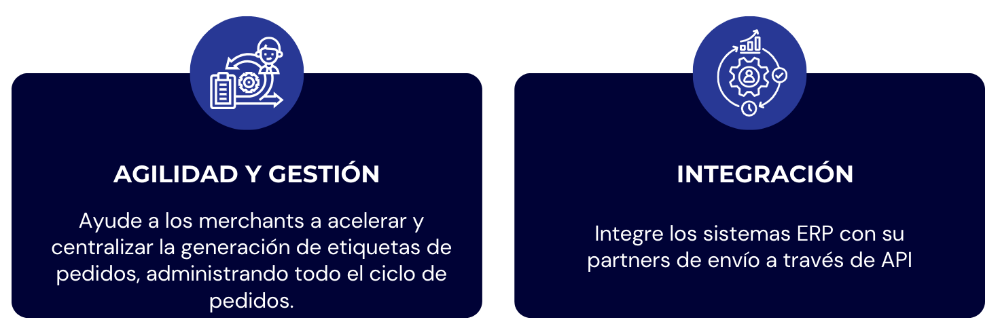
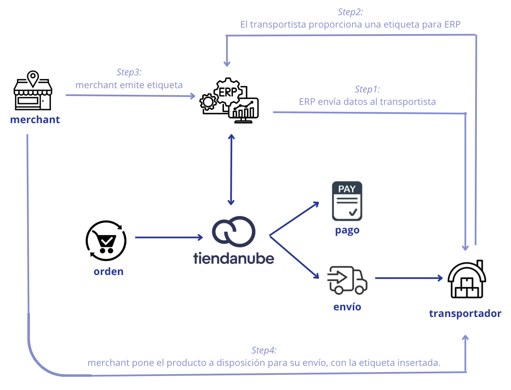

**🔹Guía de partners \- Label**

La **[API de etiquetas](https://tiendanube.github.io/api-documentation/next/resources/fulfillment-order#labels-api)** permite la **creación asincrónica**, el **seguimiento del estado** y el **download** controlado de **etiquetas** de envío para pedidos.  
Esto significa que, en lugar de que el merchant tenga que generar etiquetas directamente en el transportista, el uso de la API permite la coordinación de solicitudes de etiquetas entre la API de etiquetas y aplicaciones de terceros (transportistas).  
Una vez que se solicitan las etiquetas, el socio de envío las procesa y las pone a disposición para su descarga a través de URL seguras administradas por Tiendanube.

Esta API ofrece:

* Gestión completa del ciclo de vida de las etiquetas (creación, procesamiento, descarga, fallo/cancelación)  
* Historial de status detallado para auditoría y manejo de errores  
* Soporte a webhook para realizar un seguimiento de las actualizaciones de etiquetas  
* Integración con aplicaciones de envío a través de `callback_labels_url`

**◀️Posibles status de etiquetas:**

* `STARTED`: Solicitud iniciada, pendiente de procesamiento por parte del socio.  
* `IN PROGRESS`: El socio ha recibido la solicitud y está procesando la etiqueta.  
* `READY TO DOWNLOAD`: La etiqueta ha sido generada por el transportista y está lista para su descarga interna a través de la API de etiquetas.  
* `READY TO USE`: La etiqueta ya se ha descargado internamente y está disponible para su uso.  
* `DOWNLOADED`: La etiqueta se descargó a través de la API de etiquetas.  
* `FAILED`: El procesamiento falló.  
* `CANCELED`: La etiqueta ha sido cancelada.

⚠️Todas las actualizaciones del estado de las etiquetas se notifican mediante webhook `fulfillment_order/label_status_updated`  
Sin embargo, el estado intermedio `READY_TO_DOWNLOAD` es solo interno y no se informa mediante webhook. Este estado se utiliza durante el procesamiento interno, y solo después de una validación exitosa o fallida se envía el siguiente webhook con el estado final.

**◀️Solicitud al transportista:** `callback_labels_url`  
Cuando se crea una etiqueta, se activa un evento interno.  
Este evento es procesado por un servicio en segundo plano que agrupa los pedidos de cumplimiento por transportista y envía una solicitud a la aplicación del transportista utilizando la `callback_labels_url` configurada.

**⚠️Información importante:** 

* Hay un límite de 50 pedidos por solicitud.  
* Tiendanube espera recibir una respuesta a la solicitud del carrier (aceptada, parcialmente aceptada o fallida) en 5 segundos. Transcurrido este tiempo, se agota el tiempo de espera. A continuación, se realiza una secuencia de 3 nuevos intentos con un intervalo de 2 segundos entre cada uno.  
* Respecto al tiempo que tiene un transportista para devolver la etiqueta, una vez respondida la aceptación de generación de etiqueta, se espera que en 1 hora se generen y descarguen las mismas listas;  
* Existen ciertos [formatos de etiquetas](https://tiendanube.github.io/api-documentation/next/resources/fulfillment-order#fulfillmentorderlabeldocumentformattype) como PDF y ZPL.

**⚠️[Reglas de flujo de trabajo de estado](https://tiendanube.github.io/api-documentation/next/resources/fulfillment-order#labels-api):**

* **Flujo esperado:** STARTED → IN\_PROGRESS → \[FAILED | CANCELED | READY\_TO\_USE\] → DOWNLOADED  
* **Restricción de status final:** Etiquetas en estado final (FAILED, CANCELED, READY\_TO\_USE, DOWNLOADED) No puedo aceptar más actualizaciones de estado  
* **Excepción de cancelación:** CANCELED status se puede aplicar en cualquier punto del flujo de trabajo, excepto cuando la etiqueta está enREADY\_TO\_DOWNLOAD (internal processing)  
* **Sin flujo inverso:** Las actualizaciones de estado no pueden rebobinar a estados anteriores ni omitir estados intermedios.  
* **Tiempo de espera automático:** Etiquetas que permanecen en estado STARTED o IN\_PROGRESS por más de 30 minutos se marcará automáticamente como FAILED

**◀️Simulaciones**   
   
Un pedido puede contener varios productos del merchant. Por lo tanto, un merchant que trabaja con multi-CD podrá tener múltiples métodos de envío.  
Los productos pueden agruparse en una sola ubicación y enviarse o enviarse por separado a los Centros de Distribución.  
En un contexto donde los envíos están separados, cada transportista proporciona su propia etiqueta de envío y es el comerciante quien debe acceder a cada una de estas empresas para efectivamente emitir y así insertar la etiqueta en el pedido.

Pensando en agilidad y centralización para el merchant, es importante que el propio transportista pueda poner a disposición su etiqueta al ERP que utiliza el merchant, para que en un solo lugar el merchant pueda exportar estas etiquetas de cada transportista al que esté vinculado.

Con esto en mente, Tiendanube proporciona una **API** que permite **comunicar esta información** y ponerla a disposición para su **download** de forma **segura**, utilizando **webhooks** para una mejor integración entre sistemas.

📌 ¿Cómo funciona técnicamente el flujo de emisión de etiquetas?  
A través de nuestra documentación disponible en el [Portal de Desarrollo](https://tiendanube.github.io/api-documentation/next/resources/fulfillment-order#labels-api), brindamos detalles técnicos y su respectivo flujo de solicitud y retorno para la operación completa de emisión de etiquetas, junto con la comunicación entre Tiendanube y sus partners.

