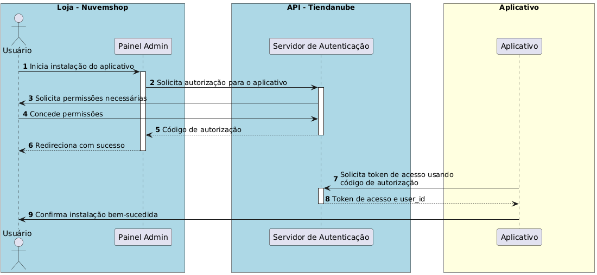
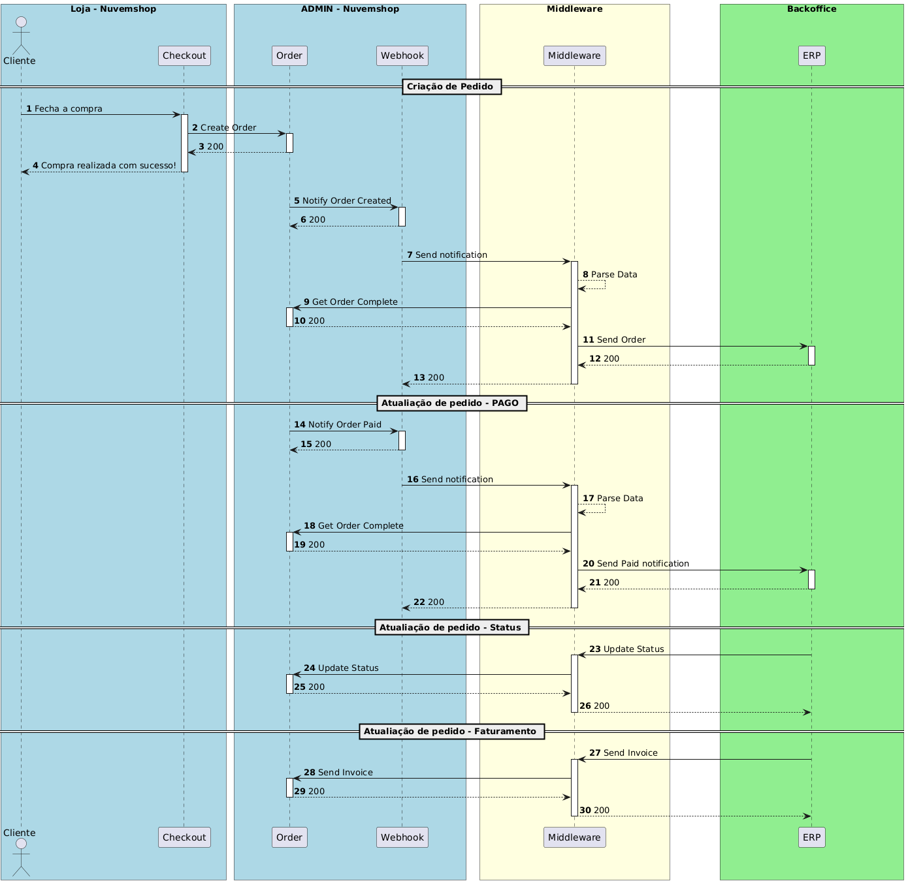

# Integration Guide 

### Guía de Integración  

En esta guía, abordaremos la forma práctica de integrar tu sistema ERP o PIM con la plataforma Nuvemshop. Aquí encontrarás instrucciones para sincronizar información crítica como pedidos, productos y stocks, garantizando eficiencia y automatización en las operaciones de back office.  

Esta guía abarca:  

- **Gestión de productos y variaciones**: Registro, actualización y control de stock.  
- **Sincronización de pedidos**: Procesamiento automatizado mediante webhooks.  
- **Gestión de stock y facturas**: Control eficiente de niveles de stock y emisión de facturas.  

Incluimos ejemplos en cURL con encabezados y detalles de los endpoints para facilitar tu implementación.  
Ideal para empresas que buscan una integración rápida y confiable, esta guía ayuda a optimizar procesos y mejorar la operación de tu e-commerce.  

### Resumen de la guía  

**1. Creación de Aplicación**  
- Proceso para crear el perfil de un socio en Nuvemshop y conectar la aplicación con la plataforma.

**Enlaces útiles:**  

- [Cómo crear una aplicación en Nuvemshop](https://ayuda.tiendanube.com/es_AR/socios-tecnologicos/como-creo-una-aplicacion-para-tiendanube)  
- [Documentación para desarrolladores](https://dev.nuvemshop.com.br/en/docs/applications/overview)  

---

### **2. Instalación y Onboarding**  
- Guía para crear una experiencia de instalación eficiente para apps públicas en la tienda de aplicaciones.  
- Enfoque en la concesión de permisos y la vinculación entre tiendas y ERPs.  

**Enlaces útiles:**  
- [Guía de Instalación](https://tiendanube.github.io/api-documentation/guides/installation)  
- [Autenticación](https://tiendanube.github.io/api-documentation/authentication)  

---

### **3. Stocks y Depósitos (Locations)**  
- Gestión de stocks distribuidos en diferentes depósitos.  

**Recursos por plan:**  
- Freemium/Plan A: 1 depósito  
- Plan B: 2 depósitos  
- Plan C: 3 depósitos  
- Enterprise: ilimitado  

**Enlaces útiles:**  
- [Multi-Inventory](https://tiendanube.github.io/api-documentation/multi-inventory-guides)  
- [API Locations](https://tiendanube.github.io/api-documentation/authentication)  

---

### **4. Productos y Variaciones**  
- Gestión de productos, categorías y variaciones, permitiendo sincronización completa entre Nuvemshop y el ERP.  

**Flujo básico:**  
1. Sincronizar productos/categorías creados.  
2. Actualizar stock, precio y atributos.  
3. Crear variaciones con SKU, nombre y stock inicial.  

**Enlaces útiles:**  
- [Productos](https://tiendanube.github.io/api-documentation/resources/product)  
- [Variaciones](https://tiendanube.github.io/api-documentation/resources/product-variant)  
- [Imágenes de Productos](https://tiendanube.github.io/api-documentation/resources/product-image)  
- [Categorías](https://tiendanube.github.io/api-documentation/resources/category)  

---

### **5. Pedidos**  
- Captura y gestión de pedidos para control de stock, facturación y logística.  

**Funciones principales:**  
1. Sincronizar pedidos existentes y nuevos.  
2. Actualizar estado de pago y envío.  
3. Generar facturas y reintegrar stock en cancelaciones.  

**Enlaces útiles:**  
- [Pedidos](https://tiendanube.github.io/api-documentation/resources/order)  
- [Webhooks de Pedidos](https://tiendanube.github.io/api-documentation/resources/webhook)  

---

### **6. Clientes**  
- Sincronización de información de clientes entre Nuvemshop y el sistema de gestión.  

**Funciones:**  
1. Capturar lista de clientes ya existentes.  
2. Crear y actualizar registros de clientes en el ERP y en Nuvemshop.  

**Enlaces útiles:**  
- [Clientes](https://tiendanube.github.io/api-documentation/resources/client)  

---

### **7. Recursos Adicionales**  
- **Buenas prácticas:**  
  - [JSON y Límites de Tasa](https://tiendanube.github.io/api-documentation/intro#just-json)  
  - [Paginación](https://tiendanube.github.io/api-documentation/intro#pagination)  
  - [Postman Collection](https://tiendanube.github.io/api-documentation/utils/postman-collections)  

---

### **8. Checklist de Homologación**  
- Checklist detallado para la homologación de aplicaciones en la App Store:
- Checklist de Homologación

---

## **Autenticación**  
La autenticación en la API de Nuvemshop utiliza una implementación restringida de OAuth 2.0, específicamente el flujo de "Código de Autorización". Este proceso permite que las aplicaciones obtengan tokens de acceso que no expiran, permaneciendo válidos hasta que se renueven o hasta que el usuario desinstale la aplicación.


[Link para criação do aplicativo](https://partners.nuvemshop.com.br/)

### **Flujo de Autorización:**  

- **Inicio de la Instalación**: El usuario, desde el panel administrativo de Nuvemshop, hace clic para instalar la aplicación o accede directamente a una URL específica para autorización.  
- **Solicitud de Permisos**: El usuario es redirigido a una página donde debe autorizar los alcances que la aplicación solicita. Si ya los ha autorizado previamente, este paso se omite.  
- **Redirección con Código de Autorización**: Después de la autorización, el usuario es redirigido a la URL de redirección de la aplicación con un código de autorización que expira en 5 minutos.  
- **Intercambio por el Token de Acceso**: La aplicación utiliza sus credenciales y el código de autorización para obtener un token de acceso mediante una solicitud POST a un endpoint específico.  

### **Ejemplo de Solicitud para Obtener el Token de Acceso:**  

```bash
curl -d '{
"client_id": "123",
"client_secret": "abcdef",
"grant_type": "authorization_code",
"code": "xyz"
}' \
-H 'Content-Type: application/json' \
-X POST "https://www.nuvemshop.com/apps/authorize/token"
```

Junto con el token de acceso, se proporciona un **user_id**, que corresponde al **ID de la tienda**.  

Este **user_id** es esencial para realizar solicitudes a la API y puede utilizarse para autenticar usuarios de la aplicación en su sitio web.  

---

## **Rate Limit - Control de Uso de la API**  

Actualmente, utilizamos el algoritmo Leaky Bucket para limitar el uso de la API.  

Por defecto, el bucket tiene capacidad para **40 solicitudes**, con una tasa de filtrado (leaky rate) de 2 solicitudes por segundo.  

Esto significa que puedes hacer hasta **2 solicitudes por segundo** en paquetes de hasta **40 solicitudes**, sin recibir el error **429 (Too Many Requests)**.  

Para monitorear el consumo de la API, proporcionamos los siguientes encabezados:  

- **x-rate-limit-limit**: Total de solicitudes permitidas en un período determinado (equivalente al tamaño del bucket).  
- **x-rate-limit-remaining**: Número de solicitudes restantes antes de llenar el bucket.  
- **x-rate-limit-reset**: Tiempo restante, en milisegundos, para que el bucket se vacíe completamente.  

**Nota importante**: El límite de uso de la API se aplica individualmente a cada tienda y aplicación.  

**Para tiendas en los planes Next o Evolution (planes superiores), el límite de tasa se multiplica por 10, permitiendo una mayor capacidad de solicitudes.**  

---

## **Filtros Generales y Paginación**  

Las solicitudes que devuelven múltiples elementos **no tienen la paginación habilitada por defecto**.  

Para navegar por los resultados, es necesario utilizar el parámetro **page** para especificar páginas adicionales.  

Además, puedes personalizar el tamaño de cada página utilizando el parámetro **per_page**, que acepta valores de hasta **200 elementos por página**.  

La numeración de las páginas comienza en 1. Si se omite el parámetro **page**, la solicitud devolverá la primera página por defecto.  

**Información útil:**  

- **Conteo total de resultados**: El encabezado **x-total-count** indica la cantidad total de elementos disponibles.  

```bash
x-total-count: 156
```

- **Enlaces de navegación**: El encabezado **Link** proporciona las URLs para las páginas siguiente y anterior, facilitando la implementación de la paginación.  

Este mecanismo permite obtener los resultados de forma organizada y eficiente, incluso en grandes conjuntos de datos.  

---

## **Stock**  

La API de Stocks de Nuvemshop permite la gestión de ubicaciones y niveles de stock en diferentes puntos de venta.  

Con ella, es posible crear, actualizar y consultar stocks en ubicaciones específicas, como tiendas físicas o almacenes.  

La API también ofrece la priorización de ubicaciones para definir el orden de procesamiento de pedidos, permitiendo una gestión eficiente e integrada de los inventarios.  

---

## **Crear un Nuevo Stock**  

Para crear un nuevo stock, utiliza el endpoint [POST /locations](https://tiendanube.github.io/api-documentation/resources/location).  

### **Solicitud:**

```bash
curl -X POST https://api.nuvemshop.com/v1/{{store_id}}/locations \
-H 'Authentication: bearer {{app_token}}' \
-H 'User-Agent: Your App Name ({{app_id}})' \
-H 'Content-Type: application/json' \
-d '{
  "name": {
    "es_AR": "Nombre del stock",
    "pt_BR": "Nome do estoque",
    "en_US": "Stock name"
  },
  "address": {
    "zipcode": "12910802",
    "street": "Rua Exemplo",
    "number": "123",
    "floor": "1º Andar",
    "locality": "Bairro Exemplo",
    "city": "São Paulo",
    "province": {
      "code": "SP",
      "name": "São Paulo"
    },
    "region": {
      "code": "SE",
      "name": "Sudeste"
    },
    "country": {
      "code": "BR",
      "name": "Brasil"
    },
    "reference": "Ponto de referência",
    "between_streets": "Entre a Rua A e Rua B"
  },
  "is_default": false,
  "allows_pickup": true,
  "priority": 1
}'
```

### **Actualizar un Stock Existente**  

Para actualizar un stock existente, utiliza el endpoint [PUT /locations/{id}](https://tiendanube.github.io/api-documentation/resources/location#put-locationsid), reemplazando **{id}** por el ID del stock.  

#### **Solicitud:**  

```bash
curl -X PUT https://api.nuvemshop.com/v1/{{store_id}}/locations/{id} \
-H 'Authentication: bearer {{app_token}}' \
-H 'User-Agent: Your App Name ({{app_id}})' \
-H 'Content-Type: application/json' \
-d '{
  "name": {
    "es_AR": "Nombre actualizado del stock",
    "pt_BR": "Nome atualizado do estoque",
    "en_US": "Updated stock name"
  },
  "address": {
    "zipcode": "12910802",
    "street": "Rua Atualizada",
    "number": "456",
    "floor": "2º Andar",
    "locality": "Bairro Atualizado",
    "city": "Rio de Janeiro",
    "province": {
      "code": "RJ",
      "name": "Rio de Janeiro"
    },
    "region": {
      "code": "SE",
      "name": "Sudeste"
    },
    "country": {
      "code": "BR",
      "name": "Brasil"
    },
    "reference": "Nuevo punto de referencia",
    "between_streets": "Entre la Calle X y la Calle Y"
  },
  "is_default": false,
  "allows_pickup": false,
  "priority": 2
}'
```

---

### **Listar Todos los Stocks**  

Para listar todos los stocks registrados, utiliza el endpoint [GET /locations](https://tiendanube.github.io/api-documentation/resources/location#get-locations).  

```bash
curl -X GET https://api.nuvemshop.com/v1/{{store_id}}/locations \
-H 'Authentication: bearer {{app_token}}' \
-H 'User-Agent: Your App Name ({{app_id}})' \
-H 'Content-Type: application/json'
```

---

### **Modificar Prioridades de los Stocks**  

Para definir las prioridades de los stocks, utiliza el endpoint [PATCH /locations/priorities](https://tiendanube.github.io/api-documentation/resources/location#patch-locationspriorities).  

La priorización del stock tendrá un impacto directo en la cotización del envío de la tienda.  
Esto se debe a que los stocks priorizados serán considerados al momento de armar el paquete de envío.  
Los productos seleccionados según esta priorización definirán el origen del envío, afectando directamente los costos de transporte, tiempos de entrega y la experiencia final del cliente.  

#### **Solicitud:**  

```bash
curl -X PATCH https://api.nuvemshop.com/v1/{{store_id}}/locations/priorities \
-H 'Authentication: bearer {{app_token}}' \
-H 'User-Agent: Your App Name ({{app_id}})' \
-H 'Content-Type: application/json' \
-d '[
  {
    "id": "01HTMFDH09VC6E2Q8KGTGP44D3",
    "priority": 0
  },
  {
    "id": "01HTMFFHWXRC8TRS40M43XGQFB",
    "priority": 1
  },
  {
    "id": "01HTMFG5VYQ8X5QW8FQ9Z7W3E1",
    "priority": 2
  }
]'
```

---

### **Definir un Stock como Predeterminado**  

Para definir un stock específico como predeterminado, utiliza el endpoint [PATCH /locations/{id}/chosen-as-default](https://tiendanube.github.io/api-documentation/resources/location#patch-locationsidchosen-as-default), reemplazando **{id}** por el ID del stock.  

#### **Solicitud:**  

```bash
curl -X PATCH https://api.nuvemshop.com/v1/{{store_id}}/locations/{id}/chosen-as-default \
-H 'Authentication: bearer {{app_token}}' \
-H 'User-Agent: Your App Name ({{app_id}})' \
-H 'Content-Type: application/json'
```

---

## **Catálogo**  

La API de Catálogo de Nuvemshop permite la gestión completa de los productos de una tienda.  

Con ella, es posible crear, actualizar, listar y eliminar productos, además de gestionar sus variaciones, precios, stocks, imágenes y personalizaciones.  

La API ofrece funciones avanzadas, como la adición de atributos personalizados y el control detallado de cada aspecto del producto, permitiendo una integración robusta con sistemas ERP, PIM u otras herramientas de gestión.  

Es importante destacar que estos campos se utilizan cuando la tienda tiene la intención de ser multilingüe.  
De lo contrario, basta con enviar el campo **"name":"nombre"**.  

---

## **Categoría**  

### **Creación de una Categoría**  

Para crear una nueva categoría, realiza una solicitud [POST al endpoint /categories](https://tiendanube.github.io/api-documentation/resources/category#post-categories).  

Asegúrate de incluir los siguientes encabezados:  
- **Authentication**: bearer {{app_token}}  
- **User-Agent**: Your App Name ({{app_id}})  

#### **Ejemplo en curl:**  

```bash
curl -X POST https://api.nuvemshop.com/v1/categories \
-H "Content-Type: application/json" \
-H "Authentication: bearer {{app_token}}" \
-H "User-Agent: Your App Name ({{app_id}})" \
-d '{
  "name": {
    "pt": "Eletrônicos",
    "en": "Electronics",
    "es": "Electrónica"
  },
  "description": {
    "pt": "Categoria de produtos eletrônicos",
    "en": "Category of electronic products",
    "es": "Categoría de productos electrónicos"
  },
  "handle": {
    "pt": "eletronicos",
    "en": "electronics",
    "es": "electronica"
  },
  "parent": null,
  "google_shopping_category": "Clothing & Accessories > Jewelry",
  "seo_title": "Categoría de productos electrónicos",
  "seo_description": "Categoría de productos electrónicos"
}'
```

---

### **Creación de una Subcategoría**  

El proceso para crear una subcategoría es similar al de la creación de una categoría.  

Debes especificar el [ID de la categoría padre en el campo parent](https://tiendanube.github.io/api-documentation/resources/category#post-categories-2).  

#### **Ejemplo en curl:**  

```bash
curl -X POST https://api.nuvemshop.com/v1/categories \
-H "Content-Type: application/json" \
-H "Authentication: bearer {{app_token}}" \
-H "User-Agent: Your App Name ({{app_id}})" \
-d '{
  "name": {
    "pt": "Smartphones",
    "en": "Smartphones",
    "es": "Smartphones"
  },
  "description": {
    "pt": "Subcategoria de smartphones",
    "en": "Smartphones subcategory",
    "es": "Subcategoría de smartphones"
  },
  "handle": {
    "pt": "smartphones",
    "en": "smartphones",
    "es": "smartphones"
  },
  "parent": 12345
}'
```

---

### **Actualización de una Categoría o Subcategoría**  

Para actualizar una categoría o subcategoría existente, realiza una solicitud [PUT al endpoint /categories/{id}](https://tiendanube.github.io/api-documentation/resources/category#put-categoriesid), donde **{id}** es el ID de la categoría que deseas actualizar.  

#### **Ejemplo en curl:**  

```bash
curl -X PUT https://api.nuvemshop.com/v1/categories/12345 \
-H "Content-Type: application/json" \
-H "Authentication: bearer {{app_token}}" \
-H "User-Agent: Your App Name ({{app_id}})" \
-d '{
  "name": {
    "pt": "Eletrônicos e Gadgets",
    "en": "Electronics and Gadgets",
    "es": "Electrónica y Gadgets"
  },
  "description": {
    "pt": "Categoria atualizada de produtos eletrônicos e gadgets",
    "en": "Updated category of electronic products and gadgets",
    "es": "Categoría actualizada de productos electrónicos y gadgets"
  }
}'
```

---

# Gestión de Productos

La API de Nuvemshop ofrece endpoints completos para gestionar productos, incluyendo la creación, actualización y enriquecimiento de datos, además de la gestión de variantes.

Los productos se pueden clasificar en dos tipos principales: **productos sin variación** y **productos con variación**.  
La distinción entre estos dos tipos afecta la forma en que se gestionan y presentan los datos del producto en la plataforma.

**Productos Sin Variación**

Estos son productos simples, que no tienen opciones adicionales para que el cliente elija.

**Ejemplos incluyen:**
- Un libro con un solo título e idioma.
- Un póster con tamaño y diseño fijos.

**Características:**

- **SKU:** Cada producto está identificado por un código SKU, generado desde el ERP/PIM.
- **Gestión directa de inventarios:** El control de inventario, precio y otros atributos se realiza directamente en el nivel del producto.

**Productos con Variación**
Estos productos ofrecen opciones para los clientes, como tamaño, color o material.

Cada combinación de opciones se llama variante, y estas variantes comparten el mismo producto base.

**¿Cómo funcionan los atributos y valores?**

Los productos con variación utilizan los conceptos de **atributos** (attributes) y **valores** (values):

- **Atributos (attributes):** Representan las opciones disponibles para el producto. Ejemplos:
    - Talla
    - Color
    - Material

- **Valores (values):** Son las opciones dentro de cada atributo. Ejemplos:
    - Para el atributo "Tamaño": S, M, L.
    - Para el atributo "Color": Azul, Rojo, Negro.
    - Cada variante se forma por una combinación específica de valores para los atributos del producto.


**Creación de Productos**

Utiliza este endpoint para crear un nuevo producto en la tienda.

[Solicitud de ejemplo:](https://tiendanube.github.io/api-documentation/resources/product)

```bash
curl -X POST https://api.nuvemshop.com/v1/{{store_id}}/products \
-H 'Authentication: bearer {{app_token}}' \
-H 'User-Agent: Your App Name ({{app_id}})' \
-H 'Content-Type: application/json' \
-d '{
  "name": "Camiseta básica",
  "description": "Camiseta 100% algodón",
  "price": 49.99,
  "sku": "CAM-001",
  "stock": 0,
  "inventory_levels": [
 	{
		"location_id": "01GQ2ZHK064BQRHGDB7CCV0Y6N",
		"stock": 5
}
  ],
  "categories": [12345],
  "images": [] // Enviar las imágenes utilizando la API de enriquecimiento
}'
```

**Listado de Productos**

Lista todos los productos registrados en la tienda.

[Solicitud de ejemplo:](https://tiendanube.github.io/api-documentation/resources/product#get-products-1)

```bash
curl -X GET https://api.nuvemshop.com/v1/{{store_id}}/products \
-H 'Authentication: bearer {{app_token}}' \
-H 'User-Agent: Your App Name ({{app_id}})' \
-H 'Content-Type: application/json'
```

**Actualización de Productos**

Utiliza este endpoint para actualizar la información de un producto existente.

[Solicitud de ejemplo:](https://tiendanube.github.io/api-documentation/resources/product#put-productsid)

```bash
curl -X PUT https://api.nuvemshop.com/v1/{{store_id}}/products/98765 \
-H 'Authentication: bearer {{app_token}}' \
-H 'User-Agent: Your App Name ({{app_id}})' \
-H 'Content-Type: application/json' \
-d '{
  "price": 54.99,
  "stock": 150
}'
```

**Actualización de Variaciones**

Permite alterar información específica de una **variante de producto (SKU)**.

[Solicitud de ejemplo:](https://tiendanube.github.io/api-documentation/resources/product-variant#get-productsproduct_idvariantsid)

```bash
curl -X PUT https://api.nuvemshop.com/v1/{{store_id}}/products/98765/variants/12345 \
-H 'Authentication: bearer {{app_token}}' \
-H 'User-Agent: Your App Name ({{app_id}})' \
-H 'Content-Type: application/json' \
-d '{
  "id": 144,
  "image_id": null,
  "promotional_price": "19.00",
  "created_at": "2013-01-03T09:11:51-03:00",
  "depth": null,
  "height": null,
  "values": [
    {
      "en": "X-Large"
    }
  ],
  "price": "25.00",
  "product_id": 1234,
  "stock_management": true,
  "stock": 5,
  "sku": "BSG1234D",
  "mpn": null,
  "age_group": null,
  "gender": null,
  "updated_at": "2013-06-01T09:15:11-03:00",
  "weight": "2.75",
  "width": null,
  "cost": "10.99"
}
'
```

**Enriquecimiento de Producto**

Para enriquecer la información de un producto, incluye campos como imágenes, descripciones más detalladas o información adicional.

[Solicitud de ejemplo para añadir una imagen:](https://tiendanube.github.io/api-documentation/resources/product-image)

```bash
curl -X POST https://api.nuvemshop.com/v1/{{store_id}}/products/98765/images \
-H 'Authentication: bearer {{app_token}}' \
-H 'User-Agent: Your App Name ({{app_id}})' \
-H 'Content-Type: application/json' \
-d '{
  "src": "https://example.com/image2.jpg"
}'
```

**Eliminación de Productos**

Permite eliminar un producto de la tienda.

[Solicitud de ejemplo:](https://tiendanube.github.io/api-documentation/resources/product#delete-productsid)

```bash
curl -X DELETE https://api.nuvemshop.com/v1/{{store_id}}/products/98765 \
-H 'Authentication: bearer {{app_token}}' \
-H 'User-Agent: Your App Name ({{app_id}})' \
-H 'Content-Type: application/json'
```

---

**Registrar una Variación de Producto**

Las variaciones de producto en Nuvemshop representan diferentes versiones de un mismo artículo, diferenciadas por atributos como tamaño, color o material.


[Requisición de ejemplo:](https://tiendanube.github.io/api-documentation/resources/product-variant#post-productsproduct_idvariants)

```bash
curl -X POST "https://api.nuvemshop.com/v1/{store_id}/products/{product_id}/variants" \
-H "Content-Type: application/json" \
-H "Authentication: Bearer {{app_token}}" \
-H "User-Agent: Your App Name ({{app_id}})" \
-d '{
  "price": 120.50,
  "stock": 20,
  "sku": "SKU-123",
  "attributes": [
    {
      "name": "Tamaño",
      "value": "M"
    },
    {
      "name": "Color",
      "value": "Azul"
    }
  ]
}'
```

**Actualizar una Variación de Producto**

URL: /products/{product_id}/variants/{variant_id}

[Requisición de ejemplo:](https://tiendanube.github.io/api-documentation/resources/product-variant#put-productsproduct_idvariantsid)

```bash
curl -X PUT "https://api.nuvemshop.com/v1/{store_id}/products/{product_id}/variants/{variant_id}" \
-H "Content-Type: application/json" \
-H "Authentication: Bearer {{app_token}}" \
-H "User-Agent: Your App Name ({{app_id}})" \
-d '{
  "id": 144,
  "image_id": null,
  "promotional_price": "19.00",
  "created_at": "2013-01-03T09:11:51-03:00",
  "depth": null,
  "height": null,
  "values": [
    {
      "en": "X-Large"
    }
  ],
  "price": "25.00",
  "product_id": 1234,
  "stock_management": true,
  "stock": 5,
  "sku": "BSG1234D",
  "mpn": null,
  "age_group": null,
  "gender": null,
  "updated_at": "2013-06-01T09:15:11-03:00",
  "weight": "2.75",
  "width": null,
  "cost": "10.99"
}'
```

**Listar Variaciones de Producto**

URL: products/{product_id}/variants

[Requisición de ejemplo:](https://tiendanube.github.io/api-documentation/resources/product-variant#put-productsproduct_idvariantsid)

```bash
curl -X GET "https://api.nuvemshop.com/v1/{store_id}/products/{product_id}/variants" \
-H "Authentication: Bearer {{app_token}}" \
-H "User-Agent: Your App Name ({{app_id}})"
```

**Buscar Detalles de una Variación Específica**
URL: products/{product_id}/variants/{variant_id}

[Requisición de ejemplo:](https://tiendanube.github.io/api-documentation/resources/product-variant#get-productsproduct_idvariantsid)

```bash
curl -X GET "https://api.nuvemshop.com/v1/{store_id}/products/{product_id}/variants/{variant_id}" \
-H "Authentication: Bearer {{app_token}}" \
-H "User-Agent: Your App Name ({{app_id}})"
```

**Eliminar una Variación de Producto**

URL: /products/variants/custom-fields/{{custom-field_id}}

Requisición de ejemplo:

```bash
curl -X DELETE "https://api.nuvemshop.com/v1/{store_id}/products/variants/custom-fields/{{custom-field_id}}" \
-H "Authentication: Bearer {{app_token}}" \
-H "User-Agent: Your App Name ({{app_id}})"
```


# Gestión de Productos con Campos Personalizados en Variantes

La API de Nuvemshop/Nuvemshop proporciona puntos finales para gestionar campos personalizados asociados a las variaciones de productos.

Estos campos permiten agregar información adicional a cada variación, enriqueciendo los datos del producto con propiedades específicas, y también pueden ser utilizados como filtros.

A continuación, detallamos las operaciones disponibles para trabajar con los Campos Personalizados.


**Listar Campos Personalizados de una Variación**

Devuelve todos los campos personalizados asociados a una variación específica de producto.

[GET /products/variants/custom-fields](https://tiendanube.github.io/api-documentation/resources/products/variants/custom-fields#get-productsvariantsidcustom-fields)

```bash
curl -X GET https://api.nuvemshop.com/v1/{{store_id}}/products/variants/custom-fields \
-H 'Authentication: bearer {{app_token}}' \
-H 'User-Agent: Your App Name ({{app_id}})' \
-H 'Content-Type: application/json'
```

**Crear un Campo Personalizado**

Permite agregar un nuevo campo personalizado a una variación de producto.

POST /products/variants/custom-fields

```bash
curl -X POST https://api.nuvemshop.com/v1/{{store_id}}/products/variants/custom-fields \
-H 'Authentication: bearer {{app_token}}' \
-H 'User-Agent: Your App Name ({{app_id}})' \
-H 'Content-Type: application/json' \
-d '{
    "name": "Production status",
    "description": "Possible product production status",
    "value_type": "text_list",
    "read_only": false,
    "values": [
        "Started",
        "In Production",
        "Finished"
    ]
}'
```

**Actualizar un Campo Personalizado**

Actualiza el valor de un campo personalizado existente.

PUT /products/variants/custom-fields/{{custom-field_id}}

```bash
curl -X PUT https://api.nuvemshop.com/v1/{{store_id}}/products/variants/custom-fields/{{custom-field_id}} \
-H 'Authentication: bearer {{app_token}}' \
-H 'User-Agent: Your App Name ({{app_id}})' \
-H 'Content-Type: application/json' \
-d '{
  "value": "poliéster"
}'
```

**Eliminar un Campo Personalizado**

Elimina un campo personalizado de una variación.

DELETE /products/{product_id}/variants/{variant_id}/custom_fields/{custom_field_id}

```bash
curl -X DELETE https://api.nuvemshop.com/v1/{{store_id}}/products/variants/custom-fields/{custom_field_id}./variants/{{variant_id}}/custom_fields/{{custom_field_id}} \
-H 'Authentication: bearer {{app_token}}' \
-H 'User-Agent: Your App Name ({{app_id}})' \
-H 'Content-Type: application/json'
```

**Resumen de Operaciones**

- **Listar Campos Personalizados:** Utiliza GET /products/variants/custom-fields para ver todos los campos de una variación.
- **Crear Campos Personalizados:** Agrega nuevos campos con POST /products/variants/custom-fields.
- **Actualizar Campos Personalizados:** Modifica valores existentes con PUT /products/variants/custom-fields/{custom_field_id}.
- **Eliminar Campos Personalizados:** Elimina campos que ya no sean necesarios con DELETE /products/variants/custom-fields/{custom_field_id}.


# Gestión de Pedidos

La API de Nuvemshop ofrece varios puntos finales para gestionar pedidos. Estos recursos permiten crear, consultar, actualizar y procesar pedidos, proporcionando control total sobre el ciclo de vida de un pedido en tu tienda virtual.

**La gestión de los pedidos debe realizarse mayormente mediante webhooks.**

Los webhooks se utilizan para notificar a tu aplicación en tiempo real sobre eventos relacionados con la gestión de pedidos, como la creación, actualización o cancelación de pedidos. A través de ellos, es posible automatizar procesos al recibir notificaciones cuando ocurren eventos en la tienda.

En el escenario detallado a continuación, el Middleware es una solución cuya responsabilidad de desarrollo es del equipo de desarrollo contratado. Esto significa que es responsabilidad del equipo del cliente diseñar, implementar y gestionar el Middleware, garantizando que cumpla con las necesidades específicas del sistema y esté debidamente integrado con los demás componentes de la solución.
Identificación de los pedidos

**En Nuvemshop, existen dos identificadores de pedido:**

**NUMBER** – Se muestra a los clientes en un formato amigable, pero no se acepta como identificador para integraciones.
**ID del pedido** – Un identificador interno compuesto por 10 dígitos, utilizado oficialmente por la plataforma.

Para fines de integración, lo más adecuado es utilizar el **ID del pedido interno**, ya que garantiza mayor precisión en la comunicación entre sistemas y evita posibles conflictos o errores que podrían ocurrir al intentar usar el NUMBER, que, aunque es fijo, no es soportado para este fin.




**Crear un Webhook para Pedidos**

Registra un nuevo webhook para eventos relacionados con los pedidos.

[POST /webhooks](https://tiendanube.github.io/api-documentation/resources/webhook#post-webhooks)

```bash
curl -X POST https://api.nuvemshop.com/v1/{{store_id}}/webhooks \
-H 'Authentication: bearer {{app_token}}' \
-H 'User-Agent: Your App Name ({{app_id}})' \
-H 'Content-Type: application/json' \
-d '{
  "event": "order/created",
  "url": "https://seusistema.com.br/webhooks/orders",
  "headers": {
    "Custom-Header": "Valor"
  }
}'
```

**Listar Webhooks Configurados**

Devuelve una lista de todos los webhooks registrados en la tienda.

[GET /webhooks](https://tiendanube.github.io/api-documentation/resources/webhook#get-webhooks)

```bash
curl -X GET https://api.nuvemshop.com/v1/{{store_id}}/webhooks \
-H 'Authentication: bearer {{app_token}}' \
-H 'User-Agent: Your App Name ({{app_id}})' \
-H 'Content-Type: application/json'
```

**Actualizar un Webhook**

Actualiza la URL o los encabezados de un webhook existente.

[PUT /webhooks/{webhook_id}](https://tiendanube.github.io/api-documentation/resources/webhook#put-webhooksid)

```bash
curl -X PUT https://api.nuvemshop.com/v1/{{store_id}}/webhooks/{{webhook_id}} \
-H 'Authentication: bearer {{app_token}}' \
-H 'User-Agent: Your App Name ({{app_id}})' \
-H 'Content-Type: application/json' \
-d '{
  "url": "https://seusistema.com.br/novourl/orders"
}'
```

**Eliminar un Webhook**

Elimina un webhook previamente configurado.

[DELETE /webhooks/{webhook_id}](https://tiendanube.github.io/api-documentation/resources/webhook#delete-webhooksid)

```bash
curl -X DELETE https://api.nuvemshop.com/v1/{{store_id}}/webhooks/{{webhook_id}} \
-H 'Authentication: bearer {{app_token}}' \
-H 'User-Agent: Your App Name ({{app_id}})' \
-H 'Content-Type: application/json'
```

**Procesar Notificaciones Recibidas**

Cuando ocurre un evento configurado, tu aplicación recibirá un POST con los siguientes datos:

Ejemplo de Payload de Notificación:

```bash
{
  "store_id": 5665778,
  "event": "order/created",
  "id": 1639882221
}
```

**Asegúrate de:**

**Validar la Solicitud:** Verifica que el payload sea el esperado y haya sido enviado por Nuvemshop.

Procesar el Evento: Realiza acciones, como crear o actualizar datos en tu sistema.

Responder con Estado 200: Devuelve un 200 OK para confirmar la recepción.

**Resumen de la Gestión de Pedidos con Webhooks**

- **Registrar Webhooks:** Usa POST /webhooks para crear notificaciones para eventos de pedidos.
- **Listar Configuraciones:** Utiliza GET /webhooks para ver los webhooks existentes.
- **Mantener Webhooks:** Actualiza (PUT) o elimina (DELETE) según sea necesario.
- **Procesar Eventos:** Recibe y procesa notificaciones para gestionar pedidos automáticamente.

Este enfoque garantiza una integración ágil y en tiempo real para la gestión de pedidos.

# Gestión de Pedidos

La API de Pedidos de Nuvemshop permite gestionar todas las transacciones realizadas en la tienda, ofreciendo recursos para consulta, actualización y seguimiento de pedidos.

Con ella, es posible acceder a detalles como el estado de pago, artículos comprados, datos del cliente y seguimiento.

La API también facilita integraciones con sistemas ERP y logísticos, garantizando una gestión eficiente y centralizada de los pedidos.

**Listar Pedidos**

Devuelve una lista de pedidos realizados en la tienda. Los resultados pueden filtrarse por varios parámetros, como fecha de creación, estado, entre otros.

[GET /orders](https://tiendanube.github.io/api-documentation/resources/order#get-orders-1)

```bash
curl -X GET https://api.nuvemshop.com/v1/{{store_id}}/orders \
-H 'Authentication: bearer {{app_token}}' \
-H 'User-Agent: Your App Name ({{app_id}})' \
-H 'Content-Type: application/json'
```

**Parámetros Opcionales:**

- **page:** Número de página.
- **per_page:** Cantidad de artículos por página.
- **status:** Filtra por el estado del pedido (e.g., abierto, cerrado, cancelado).
- **created_at_min:** Fecha mínima de creación (formato ISO 8601).
- **created_at_max:** Fecha máxima de creación (formato ISO 8601).

**Consultar Detalles de un Pedido**

Devuelve información detallada sobre un pedido específico, incluyendo artículos, métodos de envío, pagos, entre otros.

[GET /orders/{order_id}](https://tiendanube.github.io/api-documentation/resources/order#get-ordersid)

```bash
curl -X GET https://api.nuvemshop.com/v1/{{store_id}}/orders/{{order_id}} \
-H 'Authentication: bearer {{app_token}}' \
-H 'User-Agent: Your App Name ({{app_id}})' \
-H 'Content-Type: application/json'
```

**Actualizar un Pedido**

Permite actualizar información de un pedido existente, como el estado o datos del cliente.
**Los valores posibles son "open", "paid", "closed" o "cancelled"**

[PUT /orders/{order_id}](https://tiendanube.github.io/api-documentation/resources/order#put-ordersid)

```bash
curl -X PUT https://api.nuvemshop.com/v1/{{store_id}}/orders/{{order_id}} \
-H 'Authentication: bearer {{app_token}}' \
-H 'User-Agent: Your App Name ({{app_id}})' \
-H 'Content-Type: application/json' \
-d '{
    "owner_note": "Need to gift wrap this order",
    "status": "paid"
}'
```

**Cancelar un Pedido**

Cancela un pedido específico.

[DELETE /orders/{order_id}](https://tiendanube.github.io/api-documentation/resources/order#post-ordersidcancel)

```bash
curl --location 'https://api.nuvemshop.com.br/v1/{{store_id}}/orders/{{order_id}}/cancel' \
-H 'Authentication: bearer {{app_token}}' \
-H 'User-Agent: Your App Name ({{app_id}})' \
-H 'Content-Type: application/json'
```

**Resumen de la Gestión de Pedidos**

- **Listar Pedidos:** Usa GET /orders para obtener una visión general.
- **Consultar Detalles:** Usa GET /orders/{order_id} para información detallada.
- **Crear Pedidos:** Realízalo con POST /orders.
- **Actualizar Pedidos:** Actualiza datos con PUT /orders/{order_id}.
- **Cancelar Pedidos:** Elimina con DELETE /orders/{order_id}.

Esta API ofrece flexibilidad para integrar y gestionar pedidos de forma eficiente en sistemas externos.

**Fulfillment Order**

El Fulfillment Order en Nuvemshop es un recurso que permite gestionar envíos de pedidos cuando hay múltiples orígenes (locations).

Separa un pedido en diferentes "órdenes de cumplimiento" (fulfillment orders), cada una representando un envío específico con sus productos, costos y métodos de entrega.

**¿Qué podemos hacer con él?**

- Consultar órdenes de cumplimiento asociadas a un pedido.
- Actualizar información sobre el procesamiento del envío.
- Marcar un pedido como enviado cuando se despacha.
- Gestionar múltiples depósitos (locations) para definir el origen de los productos.

**Listar Fulfillment Orders**

**GET** /v1/{store_id}/orders/{order_id}/fulfillment-orders

Devuelve todas las órdenes de cumplimiento de la tienda.

**Buscar Fulfillment Order específica**

**GET** /v1/{store_id}/orders/{order_id}/fulfillment-orders/{fulfillment_order_id}

Devuelve los detalles de una orden de cumplimiento específica.

Crear un evento  
**POST** /v1/{store_id}/orders/{order_id}/fulfillment-orders/{fulfillment_order_id}/tracking-events

```bash
{
   "status": "dispatched",
   "description": "The package was dispatched",
   "address": "St. Paul 123, São Paulo - Brazil 02910802",
   "geolocation": {
      "longitude": 73.856077,
      "latitude": 40.848447
   },
   "happened_at": "2022-11-24T10:20:19+00:00",                  
   "estimated_delivery_at": "2022-11-24T10:20:19+00:00"                  
}
```

**Actualizar un evento Fulfillment Order**

**PUT** /v1/{store_id}/orders/{order_id}/fulfillment-orders/{fulfillment_order_id}/tracking-events/{fulfillment_order_tracking_event_id}

```bash
{
   "status": "in_transit",
   "description": "The package was sent to cd address.",
   "address": "St. Paul 123, São Paulo - Brazil 02910802",
   "geolocation": {
      "longitude": 73.856077,
      "latitude": 40.848447
   },
   "happened_at": "2022-11-24T10:20:19+00:00",                  
   "estimated_delivery_at": "2022-11-24T10:20:19+00:00"                  
}
```

**Eliminar un evento**

**DELETE** /v1/{store_id}/orders/{order_id}/fulfillment-orders/{fulfillment_order_id}/tracking-events/{fulfillment_order_tracking_event_id}

# Gestión de Facturación (Invoices) de Pedidos en Nuvemshop

La API de Nuvemshop permite crear y gestionar facturas (invoices) para pedidos de forma programática.

A continuación están las principales acciones relacionadas con la creación y gestión de facturas, según la documentación oficial.

**Crear una Factura**

Crea una factura para un pedido específico. Las facturas son documentos fiscales asociados a un pedido.

[POST /metafields](https://tiendanube.github.io/api-documentation/resources/order#create-an-invoice)

```bash
curl -X POST /metafields \
-H 'Authentication: bearer {{app_token}}' \
-H 'User-Agent: Your App Name ({{app_id}})' \
-H 'Content-Type: application/json' \
-d '{
  "namespace": "nfe",
  "key": "list",
  "value": "[{\"key\": \"55555555555555555555555555555\", \"link\": \"http://nfe.com.br/nsaasb\", \"fulfillment_order_id\": \"01FHZXHK8PTP9FVK99Z66GXASS\"}]",
  "description": "Lista de NFes",
  "owner_resource": "Order",
  "owner_id": 12345678
}'
```

**Notas sobre Facturas**

1. Requisitos Fiscales:
    - La implementación de facturas puede variar dependiendo de los requisitos fiscales del país de la tienda.
    - La access_key es importante en países que utilizan sistemas fiscales integrados.

2. URL de la Factura:
    - La URL proporciona un enlace directo para que el cliente visualice o descargue la factura.

3. Relación con el Pedido:
    - Cada factura está asociada a un pedido específico identificado por order_id.

4. Errores Comunes:
    - 401 Unauthorized:
        - Asegúrate de usar el token correcto en el encabezado Authentication.
    - 404 Not Found:
        - El order_id informado no fue encontrado. Verifica si el pedido existe.
    - 422 Unprocessable Entity:
        - Los datos enviados (por ejemplo, access_key o url) pueden estar en un formato inválido o incompleto.

**Ejemplo Completo de Proceso de Gestión de Factura**
1. Crear la Factura:
    - Genera una factura utilizando los datos del pedido.

2. Asociar al Pedido:
    - Usa el endpoint para asociar la factura al pedido correspondiente.
3. Enviar al Cliente:
    - Usa la URL de la factura para enviarla al cliente por correo electrónico o mostrarla en el panel de la tienda.

Con este enfoque, la gestión de facturas en Nuvemshop se realiza de forma centralizada e integrada con el pedido, garantizando cumplimiento fiscal y una experiencia optimizada para el cliente.
