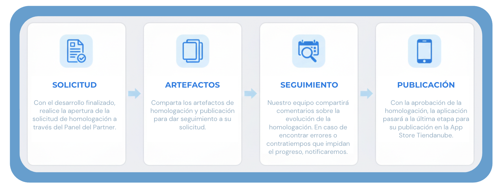

# Proceso de homologación

Las apps que no poseen flujo con datos sensibles permiten que se realicen pruebas y validaciones internas (ya que no manejan transacciones de datos reales de merchants), de las cuales el equipo técnico analizará los artefactos enviados y realizará pruebas en la aplicación.

El retorno de este análisis, así como cualquier comunicación necesaria, se dará directamente dentro de la solicitud abierta.

Por ello, es de extrema importancia seguir los flujos indicados a continuación, para garantizar una homologación ágil, coherente y dentro de los estándares Tiendanube.

## 🎯 1. Flujo de Solicitud de Homologación

Para garantizar un proceso eficiente y organizado, sigue el flujo a continuación para la homologación asíncrona de tu aplicación en la plataforma:

### 1.1. Solicitud de Homologación

- Accede a la página de la app en tu panel de partners.
- Haz clic en "Solicitar homologación".
- La plataforma enviará una comunicación informando los próximos pasos.

### 1.2. Envío de Artefactos

- Tras recibir el retorno de nuestro equipo, deberás enviar los artefactos conforme a los [requisitos obligatorios](https://dev.nuvemshop.com.br/docs/homologation/requirements)
- Asegúrate de incluir todos los elementos necesarios para una evaluación completa.

### 1.3. Validación de los Artefactos

- El **equipo de homologación** revisará cada ítem enviado.
- Se realizará la **reproducción de la instalación y configuración** de la app, garantizando que la experiencia de los comerciantes sea fluida e intuitiva.
- El proceso seguirá las **buenas prácticas de usabilidad de la API**, asegurando adherencia a los estándares esperados.

### 1.4. Retorno de la Homologación

- El partner deberá **esperar el plazo estipulado** (informado en el primer contacto de nuestro equipo) para recibir el retorno por el mismo canal de comunicación.
- Si todas las pruebas son validadas con éxito, la app avanzará a la **fase de publicación**.
- En caso de identificarse **pendientes, limitaciones de acceso o bugs, el equipo de homologación enviará un informe detallado** con los ajustes necesarios.
- El partner deberá realizar las correcciones y regresar con las evidencias de que los problemas fueron resueltos.
- Tras esta etapa, la app avanzará a la **publicación en la App Store**.

Para aplicaciones ERP, Payments y Shipping, que manejan datos sensibles y poseen mayor complejidad, se pasará por una etapa adicional de validación con demostraciones complementarias.

## 🎯 2. Validación Inicial

- El **equipo de homologación** realizará las validaciones iniciales de los artefactos enviados.
- Se llevará a cabo la **reproducción de la instalación y configuración** de la app, asegurando que la experiencia de los comerciantes sea intuitiva y alineada con las buenas prácticas de la API.

## 🎯 3. Etapa Demostrativa de Flujos

- El equipo de homologación compartirá un guion, que seguirá con una guía descriptiva de etapas (paso a paso) que deberán ser demostradas con mayor detalle.
- Esto asegurará que se muestren todos los procesos, integraciones y efectividades de los flujos.
- Compartidas las demostraciones indicadas en el guion, nuestro equipo pasará **por cada ítem de la checklist** utilizada para el desarrollo de la app.
- Garantizaremos que todos los puntos hayan sido correctamente implementados y funcionen según lo esperado.

## 🎯 4. Registro de Ajustes (Si es Necesario)

- Si se identifican pendientes en la checklist, estos se registrarán en la pestaña "Action Plan" de la checklist.
- A través de esta checklist, se deberán seguir los puntos que necesitan ser corregidos.

## 🎯 5. Nueva Validación y Publicación

- Tras realizar las correcciones necesarias, compartir un nuevo video demostrativo de las etapas ajustadas para **nueva validación** con el equipo de homologación.
- El proceso se repetirá hasta que todos los ajustes hayan sido completados.
- Cuando todos los ítems sean validados con éxito, la app avanzará a la **publicación en la App Store**.

### Checklist del Proceso de Homologación

La **checklist** se utilizará como **guía para el proceso de homologación** de apps del tipo:

<ul>
 <li><a href="https://docs.google.com/spreadsheets/d/1Pf-6Bbr8ebQGNoqkMuyK5DylP66n8FLInYbbJVRyb5Y/edit?usp=sharing" target="_blank">▶️ ERP</a></li>

 <li><a href="https://docs.google.com/spreadsheets/d/14K4y3GTYL-NDhHQOP1XTe-Clsh-UcFC6aevyVq59CoY/edit?usp=sharing" target="_blank">▶️ Payments</a></li>

 <li><a href="https://docs.google.com/spreadsheets/d/1dgKY2Ze9ZB4bqIXDuGiJzdVCCNEZgtO7BodrunRGowI/edit?usp=sharing" target="_blank">▶️ Shipping</a></li>
</ul>

Compartimos esta checklist anticipadamente para que el equipo esté preparado para las etapas que serán validadas y así tenga conocimiento de posibles ítems obligatorios que podrían impactar la aprobación de la aplicación.

Cabe reforzar que esta etapa de guion y validación de los ítems de la checklist garantizarán:

- Conformidad con las reglas de la plataforma;
- Pruebas funcionales y de integración vía API;
- Experiencia del usuario y usabilidad;
- Seguridad y desempeño.
