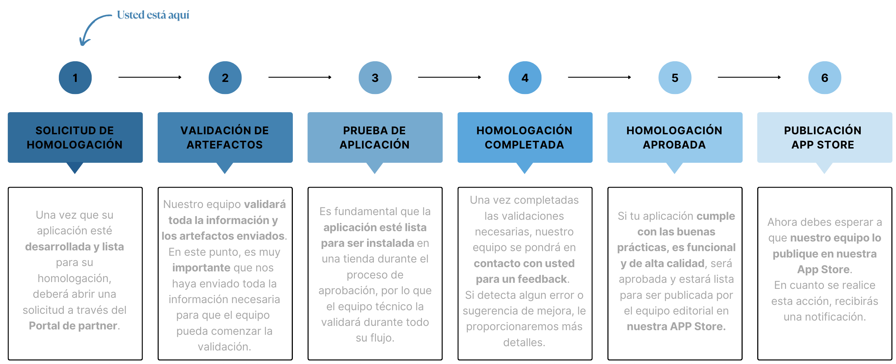

# Proceso de Homologación de Apps - Nuvemshop

## ¿Qué es una homologación de app?

La homologación es el proceso de **validación y certificación** de una aplicación dentro del ecosistema Nuvemshop.

Este proceso garantiza que la app cumpla con los criterios técnicos y funcionales esperados, asegurando una integración eficiente y segura.

Dependiendo del tipo de aplicación desarrollada, la homologación podrá seguir diferentes caminos, siendo:

- **Homologación Asíncrona:** En este proceso, deben enviarse todos los artefactos para análisis y nuestro equipo realizará pruebas para validación.
- **Homologación Síncrona:** Este escenario se aplica a aplicaciones que manejan datos sensibles, como ERP, Pagos y Envíos, donde es necesario realizar una validación conjunta, en la cual nuestro equipo llevará a cabo una reunión con el solicitante de la homologación para seguimiento y validación de la app con base en esa checklist.

 

## Visibilidad y Próximos Pasos

 

:::warning Importante
En caso de que se encuentren discrepancias, dificultades o algo que impida que nuestro equipo continúe con la homologación, nos pondremos en contacto dentro de su solicitud.
:::

 

## Homologación asíncrona

- En homologaciones asíncronas, una vez enviados todos los artefactos, el equipo realizará el análisis de los insumos y las pruebas necesarias.
- Si se cumplen todos los criterios, la app pasará a la etapa de publicación y recibirás más información para seguimiento.
- Si se identifican pendientes en las pruebas realizadas con base en los artefactos enviados, entregaremos un informe detallando cada punto a ser ajustado.
- Después de realizar los ajustes, el socio debe responder por el mismo canal con las evidencias para que podamos volver a validar los escenarios.
- Este ciclo se repetirá hasta que todos los ajustes necesarios estén completados, asegurando la calidad de la app antes de la publicación.

## Homologación síncrona

- A través de tu solicitud de homologación, nuestro equipo estará disponible para soporte y aclaración de dudas en cualquier momento, especialmente antes de la realización de la reunión.
- Durante la reunión síncrona, validaremos todos los puntos de la checklist\*, garantizando un proceso más robusto y completo.
- Si la checklist se valida y no hay ajustes al final de la reunión, la app seguirá a la etapa de publicación en la App Store.
- Si se requieren ajustes, estos se registrarán en la checklist y estarán disponibles para el socio en la pestaña Action Plan.
- Luego de implementar los ajustes, se agendará una nueva reunión para validar los puntos pendientes de la reunión anterior.
- Este proceso se repetirá hasta que todos los puntos estén completados, permitiendo que la app continúe a su publicación en la App Store.

:::warning Atención
En estos casos de homologaciones síncronas, se proporcionará un enlace para agendar la reunión.
:::

 

\* _Checklist = documento que contiene los alcances y procesos obligatorios, que serán utilizados como guía en el momento de la homologación._
