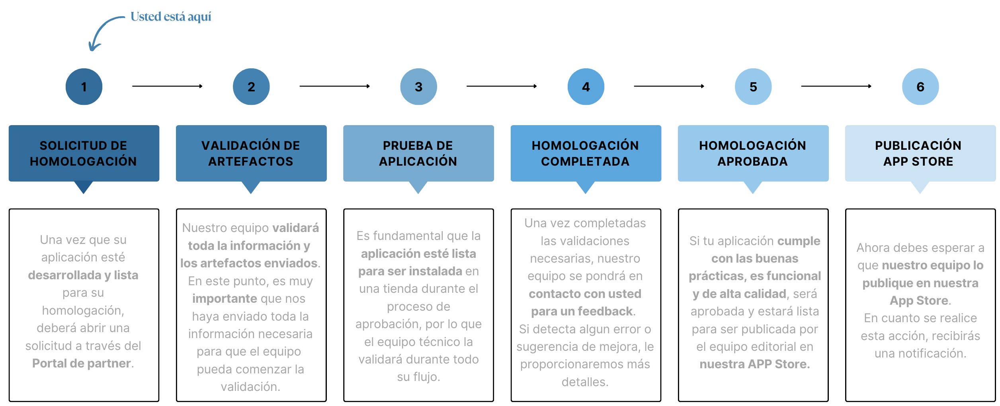

## Proceso de Homologación de Apps - Tiendanube

### 💡 ¿Qué es una homologación de app?

La homologación es el proceso de **validación y certificación** de una aplicación dentro del ecosistema Tiendanube.

Este proceso asegura que la app cumple con los criterios técnicos y funcionales esperados, garantizando una integración eficiente y segura.

Dependiendo del tipo de aplicación desarrollada, la homologación podrá avanzar de diferentes formas, siendo:

Aplicaciones del tipo **ERP**, **Payments** y **Shipping**, las cuales manejan datos sensibles y poseen una mayor complejidad, pasarán por una validación más complementaria. En estos casos, nuestro equipo enviará un guion de guía de funcionalidades y usabilidad que deberá ser demostrado y así podremos validar la aplicación con base en la checklist definida.

Para demás tipos de aplicaciones, como de marketing, herramientas, etcs, poseen una menor complejidad por no manejar transacciones de datos sensibles. En este caso, nuestro equipo podrá instalar la aplicación en tiendas internas y realizar pruebas y validaciones directamente en la aplicación.

### 💡 Visibilidad y Próximos Pasos

 

:::warning Importante
Si se encuentran divergencias, dificultades o algo que imposibilite a nuestro equipo de continuar con la homologación, nos pondremos en contacto dentro de su solicitud.
:::

 

### 💡 Proceso de homologación

- Una vez enviados todos los artefactos, el equipo realizará el análisis de los insumos y las pruebas necesarias.
- Si todos los criterios son cumplidos, la app avanzará a la etapa de publicación, y recibirás más información para el seguimiento.
- Si se identifican pendientes en las pruebas realizadas con base en el artefacto enviado, proporcionaremos una devolución listando cada punto que debe ser ajustado.
- Después de realizar los ajustes, el partner debe regresar por el mismo medio con las evidencias, para que podamos revalidar los escenarios.
- Este ciclo se repetirá hasta que todos los ajustes necesarios sean concluidos, asegurando la calidad de la app antes de la publicación.

### 💡 Proceso de homologación para los tipos ERP, Payments y Shipping

- A través de su solicitud de homologación, nuestro equipo enviará un guion de guía para que graben un video demostrando las etapas solicitadas.
- Con estas demostraciones en mano, validaremos todos los puntos de la *checklist*, garantizando un proceso más robusto y completo.
- Si la checklist es validada y no hay ajustes que realizar, la app avanzará a la etapa de publicación en la App Store.
- Si son necesarios ajustes, estos serán registrados en la checklist y podrán ser accedidos por el partner en la pestaña ‘Action Plan’.
- Después de la implementación de los ajustes, deberá enviarse una nueva demostración como evidencia para validar los puntos pendientes.
- Este proceso se repetirá hasta que todos los puntos hayan sido completados, permitiendo que la app avance a publicación en la App Store.

:::info Checklist
Documento que contiene los alcances y procesos obligatorios, que serán utilizados como guía en el momento de la homologación.
:::