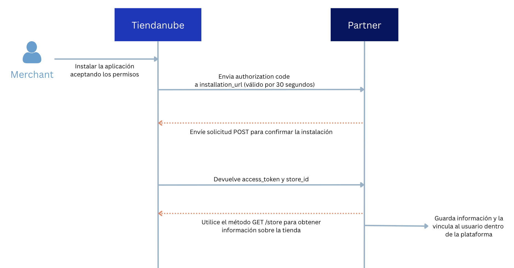

## Requisitos obligatorios para la Homologación de la Aplicación

Para garantizar un proceso de homologación eficaz, es obligatorio que los socios envíen los siguientes elementos para análisis de la plataforma. Estos ítems son fundamentales para validar el funcionamiento de la aplicación y su conformidad con las directrices establecidas.

Una vez realizada la solicitud de homologación, nuestro equipo se pondrá en contacto con usted para solicitar los artefactos que contemplan los siguientes requisitos:

## 1. Envío del Diagrama de Secuencia

El diagrama de secuencia debe ilustrar cómo la aplicación interactúa con nuestra API y qué acciones ejecuta en el *back-end*. El diagrama debe mostrar qué acciones se disparan en una interacción con la API de **Tiendanube**, qué sucede durante la transacción y cuál es el resultado (*output*) de la misma.

Este permite validar los flujos de autenticación y la interacción técnica entre la app y nuestra plataforma.

### Objetivos del diagrama de secuencia

1.1. **Garantizar que las aplicaciones hagan un uso eficiente de los recursos**, por ejemplo:

   - No realizar GETs continuos de alguna entidad para verificar si hubo cambios, cuando lo correcto sería escuchar un Webhook.
   - Modificar entidades sin necesidad (caso de uso: aplicación que modifica constantemente el stock de los productos a 0 y acto seguido lo cambia a otro valor).

1.2. **Buscar oportunidades de mejora en el flujo de trabajo de los socios**:

   - Construir una aplicación más robusta y con menos fallas.
   - Mejorar la eficiencia de su aplicación.
   - Detectar posibles problemas de seguridad.

### Ejemplo de un flujo de instalación de una aplicación:

## 2. Envío de Video Demo de la Aplicación**

El video de demostración es uno de los pilares fundamentales para la **homologación** de su aplicación. Cumple dos roles críticos en nuestro proceso de revisión:

2.1. **Criterio de Evaluación:**  
   A través de él, nuestro equipo valida si los flujos técnicos y de negocio operan conforme a los estándares de calidad exigidos.

2.2. **Guía de Usabilidad:**  
   El video sirve como la hoja de ruta oficial para que nuestro equipo pruebe el recorrido del usuario, garantizando que la experiencia del *merchant* sea intuitiva y libre de fricciones.

Asegúrese de que el video sea claro y cubra todos los puntos listados a continuación.  
Los videos incompletos pueden resultar en la devolución del proceso de homologación.

### El video de demostración de la aplicación debe incluir los siguientes escenarios:

* Instalación de la app desde Nuvemshop y no desde el panel de la app.
    * Para simular este escenario, utiliza la URL: `https://www.tiendanube.com/apps/(app_id)/authorize`.
    * Sustituye `(app_id)` por el ID de tu app, disponible en el panel de socios.
* Registro de un usuario que aún no tenga una cuenta creada.
* Demostración del login de un usuario ya registrado.
* Escenarios de reinstalación de la aplicación y su funcionamiento luego de la eliminación e instalación nuevamente.
* Simulación de todos los escenarios descritos en el diagrama de secuencia, asegurando que todos los permisos y flujos estén bien definidos.
* Flujo de uso de la app, demostrando las principales funcionalidades ofrecidas.
* Puntos relevantes para la evaluación, como interacciones específicas que sean esenciales para la homologación.
* Si se requiere alguna configuración técnica para usar la app, se recomienda que esté especificada y orientada al merchant sobre cómo realizar dicha acción.

### 3. Atención a las Etapas de Suscripción y Restricciones**

Si la aplicación incluye suscripción a un plan, espera un tiempo para que se libere el registro o cualquier otra etapa que pueda impedir la validación inmediata de la app.  
**Envía una cuenta demo ya liberada de esas etapas**, permitiendo que el equipo de homologación acceda y valide sin interrupciones en el flujo de homologación.

Para garantizar la agilidad en su homologación, infórmenos previamente sobre aquellos flujos que requieran plazos de activación o suscripciones a planes, los cuales deberán ser notificados para su liberación.

Es esencial que nuestro equipo experimente la **jornada real del merchant** durante todo el proceso de instalación y configuración de la aplicación.

:::warning Importante
El envío correcto de estos requisitos garantizará un proceso de homologación ágil y eficiente, permitiendo que tu aplicación avance hacia la fase de publicación sin contratiempos.
:::

 