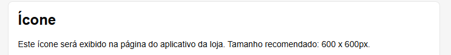

# Requisitos Obligatorios

## 1. Imágenes de la aplicación

- Descarga las imágenes de divulgación de la aplicación en "**Imágenes de la aplicación**", las cuales solo serán aprobadas si tienen la dimensión correcta solicitada de **1600 x 800 px**.

Estas imágenes deben mostrar las pantallas de la aplicación y divulgar sus principales funcionalidades, despertando el interés del minorista (o dueño de la tienda) en instalarla. Las mismas imágenes se comparten en todos los idiomas; por lo tanto, si tu aplicación se publica en todos los países, el texto de las imágenes debe estar tanto en portugués como en español.

## 2. Ícono de la aplicación

Descarga el ícono de la aplicación desde "**Ícono**", que solo se aprobará si tiene el tamaño correcto requerido de **600 x 600 px**. Esta imagen será el logotipo de tu aplicación.

## 3. Método de facturación

- En "**Idiomas de la tienda de aplicaciones**", selecciona el país en el que se publicará la aplicación para rellenar, a continuación, todos los campos solicitados.
- Selecciona el tipo de pago que deseas utilizar en "**Método de facturación**":
  - Gratuito (billing propia del socio/partner, con opción o no de tener "**Ventas en la aplicación**").
  - Valor único (billing de Tiendanube, pago único).
  - Valor mensual (billing de Tiendanube, valor mensual).

## 4. Descripción del perfil de la aplicación

- En "**Información**" (o "**Detalles**"), rellena los campos de descripción de la aplicación. **¡Esta es la parte más importante!** La información presente en los campos de descripción "**corta**" y "**larga**" **será la vidriera de tu aplicación en la Tienda de Aplicaciones**, lo que los minoristas verán y lo que los incentivará a instalarla.

Tiendanube ha creado una guía para que tu descripción contenga la mayor cantidad de palabras clave posible, garantizando un buen resultado en el campo de búsqueda de la Tienda de Aplicaciones cuando el minorista busque alguna funcionalidad o necesidad que tu aplicación resuelva. Utiliza exactamente esta estructura:

**Descripción del perfil de la aplicación**

Plantilla de descripción completa de la aplicación - Tiendanube

**Nombre de la aplicación**: Aplicación “X”

**Descripción breve**: [Introduce una descripción que resuma la función de tu app (máximo 64 caracteres, incluyendo espacios)].

Ejemplo: Envíos más económicos con las mejores empresas de transporte del país.

**Campo de descripción completa**

### 1. Introducción

Explica claramente la propuesta de valor de tu aplicación y su ventaja competitiva en el mercado. Esto animará a los comerciantes a seguir leyendo.

Ejemplo: “La Aplicación X es la solución para emprendedores digitales que necesitan envíos (o fletes) más baratos y flexibles en su tienda virtual. Obtén integración completa con Correos y las principales transportadoras del país sin necesidad de un contrato. Cuenta, además, con funcionalidades exclusivas como cotización de envío, generación de etiquetas y programación de recogida (o agendamiento de retiro).”

Si lo tienes, puedes insertar un video breve presentando la app. Un medio audiovisual enriquece tu página e incentiva al usuario a permanecer más tiempo en ella.

### 2. ¿Qué es la aplicación X?

Ve directo al punto y explica qué hace tu aplicación y el impacto o facilidad que aporta al comerciante.

Ejemplo: “La aplicación X es una aplicación desarrollada por [nombre de la empresa] para facilitar la integración de tu tienda online Tiendanube con diversas empresas de envío brasileñas. Solo necesitas instalar la aplicación para acceder a numerosas opciones de envío y encontrar soluciones más rápidas y económicas para enviar tus productos.”

### 3. ¿Cómo funciona la aplicación X?

Sé directo y utiliza viñetas para facilitar la lectura y la comprensión.

Ejemplo: “La aplicación X conecta su tienda en línea con operadores de todo el país, con cobertura en más de 3000 municipios.”

- Tienes la opción de agendar retiros y también configurar la logística inversa.
- Los pedidos permitidos deben tener una dimensión de hasta **80 cm x 80 cm x 80 cm** y un peso de hasta **30 kg**. Consulta el área de cobertura en este enlace.

### 4. ¿Cuáles son las características de la aplicación X?

Sé directo y utiliza viñetas para facilitar la lectura y la comprensión.

Ejemplo: “La aplicación X ofrece las siguientes características:”

- Búsqueda de transportadoras de acuerdo con el perfil de productos y de entrega;
- Integración directa con tarifas de envío;
- Creación de promociones de flete más barato y envío gratis;
- Generación de etiquetas;
- Envío automático de correos electrónicos de envío y entrega;
- Rastreo de pedidos en línea.

### 5. Ventajas de instalar la aplicación X

Sé directo y utiliza viñetas para facilitar la lectura y la comprensión.

Ejemplo: “Al instalar la aplicación X en su Tiendanube, disfrutará de las siguientes ventajas:”

- Envíos más baratos y competitivos;
- Centralización de toda la actividad logística en una única aplicación;
- Rastreo de pedidos en todas las etapas del envío;
- Mayor cobertura de Brasil para operadores logísticos;
- Cálculo de envío simplificado en tu tienda virtual.

### 6. Planes y precios para comerciantes de Tiendanube

Si es posible, detalla los planes y precios, así como cualquier oferta específica para los clientes de Tiendanube.

Ejemplo: “Puedes probar la aplicación X gratis durante 30 días y elegir entre los siguientes planes:”

- Esencial por $59/mes;
- Control por $99/mes;
- Completo por $199/mes.

Encontrarás más detalles sobre planes y precios en este enlace.

### 7. ¿Cómo integro la aplicación X con Tiendanube?

Proporciona un resumen paso a paso de cómo instalar la aplicación.

Ejemplo: “Para integrar la aplicación X con su tienda Tiendanube, simplemente siga los pasos a continuación:”

- Haz clic en "Instalar Aplicación";
- Acepta los permisos de la aplicación;
- Crea una cuenta en la Aplicación X;
- Valida el código en tu Panel Tiendanube.

Si tienes alguna duda, consulta las instrucciones paso a paso sobre cómo instalar la aplicación X. (Enlace)

### 8. Apoyo al minorista

Indica todos los canales de soporte, así como los SLA de respuesta y el horario de atención.

Ejemplo: “Si tiene alguna pregunta, póngase en contacto con nosotros a través de los siguientes canales de atención al cliente:”

- Por correo electrónico: suporte@app.com.br — tiempo de respuesta promedio de 24 horas;
- Chat en línea a través del sitio web — de lunes a viernes de 9:00 a 18:00 y sábados de 9:00 a 15:00;
- WhatsApp al xx-xxxx-xxxx — de lunes a viernes de 9:00 a 18:00 y sábados de 9:00 a 15:00;
- Teléfono: xx-xxxx-xxxx — servicio las 24 horas.

**Buenas prácticas para estos formularios**

Sigue exactamente la estructura de la Guía de descripción de la aplicación anterior.

También tienes la opción de utilizar el **agente de inteligencia artificial de Tiendanube**, el "**Generador de descripciones de aplicaciones en la Tienda de Aplicaciones de Tiendanube**", para ayudarte a crear esta descripción completa de forma rápida y sencilla.

1. Accede al agente ChatGPT "[Tiendanube Appstore Description Generator](https://chatgpt.com/g/g-684a0c4e5ee8819199c155f69f465e4e-app-description-generator-tiendanube-nuvemshop)" haciendo clic en el enlace para iniciar la generación interactiva de la descripción larga.
2. **Define las fuentes de información**: inserta la URL del sitio web oficial de tu aplicación, enlaces a artículos o tutoriales del Centro de Ayuda y/o sube un documento (PDF o DOCX) con una descripción general de las funciones, asegurando que se cubran todas las secciones de la guía (propósito, beneficios, características, etc.).
3. **Especifica las regiones de publicación y los detalles específicos**: indica los países donde estará disponible la aplicación y detalla cualquier diferencia en las características por región (por ejemplo, módulo de impuestos activo solo en Chile), para que el agente pueda adaptar el contenido en consecuencia.
4. **Espera a que se generen los bloques HTML optimizados para SEO para su integración**: el agente le enviará, directamente en el chat, un bloque de código HTML para cada país definido. Estos bloques estarán listos para incorporarse a la página de la aplicación, respetando la jerarquía de encabezados y evitando conflictos de elementos, adaptados al idioma local, como portugués para Brasil o español para Argentina.
5. **Publica en el panel de integración de Tiendanube**: copia cada bloque HTML devuelto y pégalo en el campo de descripción correspondiente a cada país en el editor de integración; luego guarda y publica los cambios.

## 5. FAQs (Preguntas frecuentes)

Es obligatorio proporcionar al equipo de Tiendanube, durante la fase de homologación y junto con la demás documentación compartida, el documento de preguntas frecuentes (FAQ), que contiene las dudas más comunes sobre su aplicación.

Ten especial atención a los contactos de soporte (nivel 1, nivel 2, técnico y comercial) y a la disponibilidad de cuentas de prueba.

Tiendanube ha creado una plantilla para cada categoría que puedes utilizar como guía.

- Las preguntas del documento de preguntas frecuentes (FAQ) variarán según la categoría de su solicitud.
- Copia la plantilla de documento que aparece a continuación y compártela con su solicitud de aprobación.

> ▶️ **FAQs ERP**  
> [Template FAQ ERP](https://docs.google.com/document/d/1n0M6LV1FiArb5IPPYI7CXUVFoVPUF7CHR9wuR-3wp94/edit?tab=t.0#heading=h.u4429oqdb513)

> ▶️ **FAQs Métodos de pago**  
> [Template FAQ Payments](https://docs.google.com/document/d/1lnmbvwFt5wh6F78e8_ANo2oMEP-rfJaENA8qr-SHlD4/edit?tab=t.0#heading=h.u4429oqdb513)

> ▶️ **FAQs Recursos Logísticos**  
> [Template FAQ Shipping](https://docs.google.com/document/d/1753SRNZXOO0BilnaJDPdNtIHyiRmNPrLcTjpTMyavPo/)

> ▶️ **FAQs Marketing y otras categorías**  
> [Template FAQ Marketing e demais categorias](https://docs.google.com/document/d/1cEnV0i0sRN5cblnZ55xHOca_Uf-Ll9er0zyPHoW9ocE/edit?tab=t.0#heading=h.u4429oqdb513)