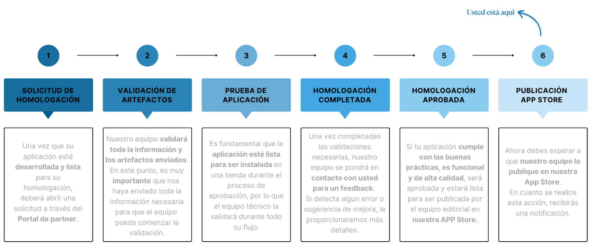

# Proceso de Publicación de la Aplicación

En esta sección, proporcionaremos una guía paso a paso para que puedas publicar tu aplicación en la Tienda de Aplicaciones de Tiendanube.

Para la publicación de la aplicación, hay **dos etapas** que deben realizarse de forma independiente y paralela:

## Etapa 1: Envío de los artefactos

* Una vez realizada la solicitud de homologación (aprobación/certificación), recibirás un correo electrónico con instrucciones y la solicitud de envío de archivos.
* Estos archivos se denominan artefactos, y contemplarán archivos relacionados con el flujo de homologación y otros relacionados con el flujo de publicación.
* Todos estos archivos, es decir, el artefacto completo, deberán ser enviados para que el equipo pueda iniciar las validaciones de la aplicación.

::: warning
La etapa de homologación y publicación solo comienza después del envío de todos los artefactos.
:::

## Etapa 2: Relleno de los datos de la aplicación

* Es necesario rellenar todos los campos obligatorios en el Panel del Partner de Tiendanube, en la sección "Datos de Publicación".
* Esto garantizará que tu aplicación tenga todos los datos ya completados y, en consecuencia, será publicada más rápidamente en la Tienda de Aplicaciones Tiendanube.

En esta documentación, obtendrás orientación para realizar todas las etapas.

**Publicación de una aplicación en Tiendanube**

A través de la sección "Datos de Publicación", puedes publicar tu aplicación para que esté disponible en la Tienda de Aplicaciones de Tiendanube.

* Dentro del panel, haz clic en "**Datos de publicación**" y luego en "**Editar datos**" para continuar.

* Asegúrate de que todos los campos de "**URLs y contacto**" y "**Handle de la aplicación**" estén debidamente rellenados.