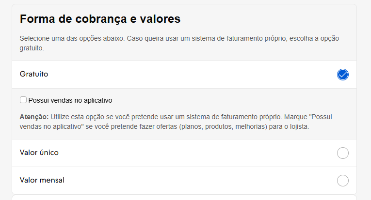

# Requisitos Obligatorios

## 1. Imágenes de la aplicación

* Descarga las imágenes de divulgación de la aplicación en "**Imágenes de la aplicación**", que solo serán aprobadas si están en la dimensión solicitada correcta
* Será necesario subir un paquete de imágenes específico para cada país de actuación, como Brasil, México y Argentina.

Estas imágenes deben mostrar las pantallas de la aplicación y divulgar sus principales funcionalidades, despertando el interés del comerciante en instalarla.

## 2. Ícono de la aplicación

Descarga el ícono de la aplicación en "**Ícono**", que solo será aprobado si está en la dimensión solicitada correcta. Esta imagen será el logotipo de tu aplicación.

* Formatos permitidos: JPEG y PNG
* Los GIF no son compatibles
* Cantidad: mínimo 3 y máximo 5

## 3. Forma de cobro

* En "**Idiomas de la tienda de aplicaciones**" selecciona el país en el que la aplicación será publicada para completar a continuación todos los campos solicitados.
* Selecciona en "**Forma de cobro**" el tipo de cobro que será usado:
  * Gratuito (billing propio del socio con opción o no de tener **"Ventas en la aplicación"**)
  * Valor único (billing Tiendanube, valor único)
  * Valor mensual (billing Tiendanube, valor mensual)

## 4. Descripción del perfil de la aplicación

* En "**Información**" completa los campos de descripción de la aplicación. ¡Esta es la parte más importante! La información presente en los **campos de descripción "corta" y "larga"** será la vitrina de tu aplicación en la Tienda de Aplicaciones, lo que los comerciantes verán y los incentivará a instalarla.

Tiendanube creó una guía para que tu descripción tenga la mayor cantidad de palabras clave posible, garantizando un buen retorno en el campo de búsqueda de la Tienda de Aplicaciones cuando el comerciante busque alguna funcionalidad o necesidad que tu aplicación resuelve. Usa exactamente esta estructura:

**Descripción del perfil de la aplicación**

Modelo de Descripción Completa de Aplicación - Tiendanube

**Nombre de la app:** Aplicación "X"

**Campo descripción corta:** [Inserta una descripción que resuma la función de tu app]. Ejemplo: *Fletes más baratos con las mejores transportadoras del país.*

**Campo descripción completa**

1. **Introducción:**

Deja clara la propuesta de valor de tu aplicación y su diferencial en el mercado. De esta forma, el comerciante tendrá interés en continuar la lectura.

Ejemplo: *“La Aplicación X es la solución para emprendedores digitales que necesitan fletes más baratos y flexibles en su tienda virtual. Ten integración completa con Correos y las principales transportadoras del país sin necesidad de contrato. Cuenta además con funcionalidades exclusivas como cotización de flete, generación de etiquetas y programación de recolección.”*

Si lo deseas, puedes insertar un video breve presentando la app. Un medio audiovisual enriquece tu página e incentiva al usuario a permanecer más tiempo en la página.

2. **¿Qué es la Aplicación X?**

Ve directo al punto, explica lo que hace tu app y el impacto/facilidad que aporta al comerciante.

Ejemplo: *“Aplicación X es una app desarrollada por [nombre de la empresa] para facilitar la integración de tu tienda virtual Tiendanube con diversas transportadoras brasileñas. Solo necesitas instalar la aplicación para tener acceso a innumerables opciones de flete y encontrar soluciones más ágiles y baratas para enviar tus productos.”*

3. **¿Cómo funciona la Aplicación X?**

Sé directo y utiliza viñetas para facilitar la lectura y comprensión. Ejemplo: *“La Aplicación X conecta tu tienda virtual con transportadoras en todo el territorio nacional, con cobertura para más de 3 mil municipios.”*

* Tienes la opción de programar recolecciones y también configurar la logística inversa.
* Los envíos permitidos deben tener dimensión de hasta 80 cm x 80 cm x 80 cm y peso de hasta 30 kg. Consulta el área de cobertura en este enlace.

4. **¿Cuáles son las funcionalidades de la Aplicación X?**

Sé directo y utiliza viñetas para facilitar la lectura y la comprensión. Ejemplo: *“La Aplicación X ofrece las siguientes funcionalidades:”*

* Búsqueda de transportadoras de acuerdo con el perfil de productos y de entrega;
* Integración directa con tablas de fletes;
* Creación de promociones de flete más barato y flete gratis;
* Generación de etiquetas;
* Envío automático de e-mails de despacho y entrega;
* Seguimiento de envíos en línea.

5. **Ventajas de instalar la Aplicación de X**

Sé directo y utiliza viñetas para facilitar la lectura y la comprensión. Ejemplo: *“Tienes las siguientes ventajas al instalar la Aplicación X en tu Tiendanube:”*

* Fletes más baratos y competitivos;
* Centralización de toda la actividad logística en una única app;
* Seguimiento de envíos en todas las etapas del despacho;
* Mayor cobertura de Brasil para operadores logísticos;
* Cálculo de flete simplificado en tu tienda virtual.

6. **Planes y Precios para comerciantes Tiendanube**

Si es posible, detalla los planes y precios, además de ofertas específicas para clientes Tiendanube.

Ejemplo: *“Puedes probar la Aplicación X gratis por 30 días y elegir entre los siguientes planes:”*

* Esencial por R$ 59/mes;
* Control por R$ 99/mes;
* Completo por R$ 199/mes.

Ve más detalles sobre planes y precios en este enlace.

7. **¿Cómo integrar la Aplicación X con Tiendanube?**

Presenta un resumen del paso a paso para instalar la aplicación.

Ejemplo: *“Para integrar la Aplicación X a tu tienda Tiendanube, solo debes seguir los pasos a continuación:”*

* Haz clic en “**Instalar Aplicación**”;
* Acepta los permisos de la aplicación;
* Crea una cuenta en la Aplicación X;
* Valida el código en tu panel Tiendanube;
* ¡Listo! Ya puedes usar la Aplicación X para conseguir fletes más baratos.

Si tienes dudas, consulta el paso a paso de cómo instalar la Aplicación X. (Enlace)

8. **Soporte al comerciante**

Informa todos los canales de soporte, así como SLA de respuesta y horario de atención. Ejemplo: *“Si tienes dudas, ponte en contacto en los siguientes canales de atención:”*

* Por e-mail **suporte@app.com.br** — tiempo promedio de respuesta de 24 horas;
* **Chat online** por el sitio — de Lunes a Viernes de 9h a 18h y los Sábados de 9h a 15h;
* **WhatsApp** en el número xx-xxxx-xxxx — de Lunes a Viernes de 9h a 18h y los Sábados de 9h a 15h;
* **Teléfono** xx-xxxx-xxxx — atención 24 horas.

## ⭐ Buenas prácticas para estos completados

Sigue exactamente la estructura de la Guía de descripción de la aplicación anterior.

También tienes la opción de usar el **Agente de Inteligencia Artificial de Tiendanube** "**Generador de Descripción de la Aplicación en la Tienda de Aplicaciones Tiendanube**" para ayudarte a crear esta descripción completa de una forma fácil y rápida.

1. Accede al agente ChatGPT "[Tiendanube Appstore Description Generator](https://chatgpt.com/g/g-684a0c4e5ee8819199c155f69f465e4e-tiendanube-appstore-description-generator)" haciendo clic en el enlace para iniciar la generación interactiva de la descripción larga.

2. **Define las fuentes de información:** inserta la URL del sitio oficial de tu app, enlaces de artículos o tutoriales del Help Center y/o sube un documento (PDF o DOCX) con el overview de las funcionalidades, garantizando la cobertura de todos los bloques de la guía (objetivo, beneficios, funcionalidades, etc.).

3. **Especifica las regiones de publicación y particularidades:** informa los países donde la app estará disponible y detalla eventuales diferencias de recursos por región (por ejemplo, módulo fiscal activo solo en Chile), para que el agente adapte el contenido adecuadamente.

## 5. FAQs (Preguntas Frecuentes)

Es obligatorio disponibilizar para el equipo de Tiendanube, en la etapa de homologación junto con los demás artefactos compartidos, el documento de FAQs con las preguntas más frecuentes sobre tu aplicación.

Presta especial atención a los contactos de soporte (nivel 1, nivel 2, técnico y comercial) y a la disponibilidad de cuentas de prueba.

Tiendanube creó un modelo para cada categoría para uso estándar que deberás utilizar como guía.

* Las preguntas del documento de FAQs deben variar de acuerdo con la categoría de tu aplicación.

* Copia el modelo del documento dispuesto abajo y compártelo junto con tu solicitud de homologación.

> ▶️ **FAQs ERP**
[Template FAQ ERP](https://docs.google.com/document/d/1n0M6LV1FiArb5IPPYI7CXUVFoVPUF7CHR9wuR-3wp94/edit?tab=t.0#heading=h.u4429oqdb513)

> ▶️ **FAQs Medios de Pago**
[Template FAQ Payments](https://docs.google.com/document/d/1lnmbvwFt5wh6F78e8_ANo2oMEP-rfJaENA8qr-SHlD4/edit?tab=t.0#heading=h.u4429oqdb513)

> ▶️ **FAQs Medios de Logística**
[Template FAQ Shipping](https://docs.google.com/document/d/1753SRNZXOO0BilnaJDPdNtIHyiRmNPrLcTjpTMyavPo/edit?tab=t.0#heading=h.u4429oqdb513)

> ▶️ **FAQs de Marketing y demás categorías**
[Template FAQ Marketing y demás categorías](https://docs.google.com/document/d/1cEnV0i0sRN5cblnZ55xHOca_Uf-Ll9er0zyPHoW9ocE/edit?tab=t.0#heading=h.u4429oqdb513)