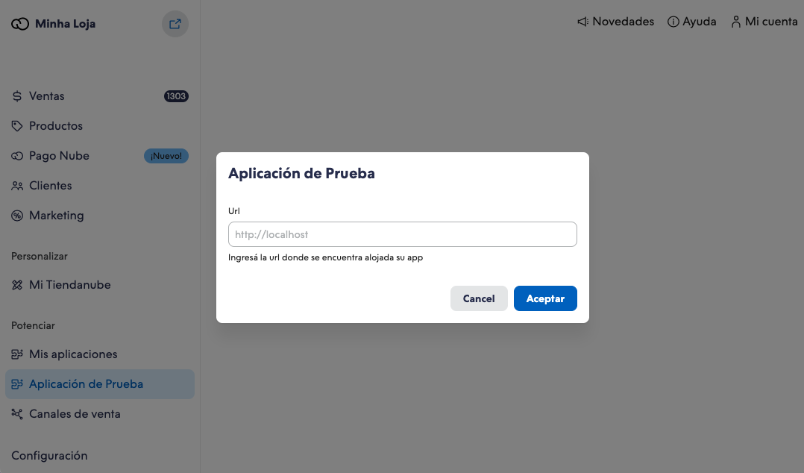

# Overview

Um aplicativo nativo na Nuvemshop é aquele que opera no contexto do painel de administração, utilizando um iframe para garantir integração e fluidez. Essa abordagem busca oferecer experiências mais naturais e integradas para a gestão das lojas, aprimorando a interação com funcionalidades externas.

## Requisitos para aplicativos nativos

Para desenvolver um aplicativo nativo, é crucial compreender os requisitos técnicos e funcionais. A integração ocorre por meio do [Nexo](../developer-tools//nexo.md), nossa ferramenta de comunicação entre aplicativos nativos e o painel de administração. O design é garantido pelo nosso design system [Nimbus](../developer-tools/nimbus.md), que assegura a coesão visual com o Admin e agiliza o desenvolvimento. É essencial utilizar a stack [React](https://react.dev) no frontend, já que o **Nimbus** é otimizado para essa plataforma.

## Início do Desenvolvimento

Antes de iniciarmos, faremos uma visão geral para compreender os principais atores e seus papéis no fluxo de iniciação.

Identificamos três atores que interagem entre si: o aplicativo desenvolvido pelo parceiro (doravante **"Native app"**), o painel de administração da Nuvemshop (doravante **"Admin"**) e o SDK que possibilita a conexão entre o Admin e o aplicativo nativo (doravante **"Nexo"**). Vamos explorar as responsabilidades de cada um desses atores.

### Native app

Este é o aplicativo que você irá desenvolver. O aplicativo final estará publicamente acessível por meio de uma URL. Ele será carregado no Admin através de um iframe, o que exige uma URL pública para o aplicativo. A URL pública é fornecida durante a criação do app dentro do [Portal de Parceiros](https://partners.nuvemshop.com.br).

Para garantir a compatibilidade do **Native app** com o **Admin**, é essencial ter o **Nexo** instalado e configurado. [Nesta documentação](../developer-tools//nexo.md), você encontrará informações detalhadas sobre o funcionamento do Nexo.

Neste momento, abordaremos apenas os passos fundamentais:

1.  Para iniciar a comunicação entre o **"Native app"** e o **Admin**, você deverá utilizar o **Nexo**. Veja abaixo um trecho de código que demonstra como isso é feito:

    ```jsx
    // nexoClient.ts
    import nexo from "@tiendanube/nexo";

    const instance = nexo.create({
      clientId: "123",
      log: true,
    });

    export default instance;
    ```

2.  Após estabelecer a comunicação, o **"Native app"** deve notificar explicitamente o **Admin** de que está pronto para ser exibido. Isso é feito no ponto inicial da aplicação React, conforme demonstrado no trecho de código abaixo:

    ```jsx
    import { useEffect, useState } from "react";
    import { connect, iAmReady } from "@tiendanube/nexo/helpers";
    import nexo from "./nexoClient";

    const App: React.FC = () => {
      const [isConnect, setIsConnect] = useState(false);

      useEffect(() => {
        connect(nexo).then(async () => {
          setIsConnect(true);
          iAmReady(nexo);
        });
      }, []);

      if (!isConnect) return <div>connecting..</div>;

      return <div>My app</div>;
    };

    export default App;
    ```

3.  Por último, você implementará a lógica do modelo de negócios do **"Native app"** usando as diversas ações que disponibilizamos no Nexo. Confira a lista de ações disponíveis [aqui](../developer-tools/nexo.md#actions).

### Nexo

O **Nexo** é o SDK que possibilita a comunicação entre o **Admin** e o **Native app**. Desenvolvido pela Nuvemshop, é compatível com TypeScript e pode ser acessado através do NPM.

- Funciona como a ponte de comunicação entre o **Admin** e o **Native app**.
- Define e gerencia as ações disponíveis, que são trocadas por meio de mensagens. Veja a lista de ações disponíveis [aqui](../developer-tools/nexo.md#actions).
- Oferece ferramentas para facilitar a implementação de ações no aplicativo. Saiba mais sobre os Helpers [aqui](../developer-tools/nexo.md#helpers).

### Admin

O ator **Admin** desempenha um papel fundamental no gerenciamento do lojista Nuvemshop atualmente logado, incluindo:

- O Admin oferece um espaço de desenvolvimento específico que possibilita a criação e teste do seu aplicativo sem a necessidade de aprovação na Appstore. Abordaremos a seguir como isso pode ser realizado.
- Definir o acesso do aplicativo (rotas): A Nuvemshop fornecerá uma rota (URL) na qual seu aplicativo será convocado.
- Estabelecer onde a aplicação deve ser carregada através de um iframe.
- Inicializar o **Nexo** para receber e enviar mensagens conforme necessário para o aplicativo.
- Verificar se o aplicativo está pronto para ser exibido.
- Gerenciar tokens de sessão e compartilhar com o aplicativo via **Nexo** para identificar a Loja logada.

## Fluxo de inicialização do aplicativo

Aqui está o fluxo de iniciação de um **Native app** a partir do momento em que o usuário decide visualizar o aplicativo:

1. O usuário escolhe abrir o aplicativo, que pode ser acionado por meio de uma URL salva como favorito ou uma opção no menu.
2. O **Admin** obtém as informações do aplicativo e carrega o aplicativo dentro do painel em um iframe, enquanto exibe uma mensagem de carregamento.
3. Após o carregamento do **Native app**, ele notifica o **Admin** por meio do **Nexo** sobre a conexão e aguarda a confirmação de que o **Admin** também está conectado.
4. Finalmente, quando o **Native app** estiver pronto para exibir o conteúdo, ele notifica por meio do **Nexo** que está pronto. Isso permite que o **Admin** substitua a mensagem de carregamento pelo próprio **Native app**.

## Escolhendo meu template

Nossas ferramentas de desenvolvimento na Nuvemshop incluem templates prontos para a criação de aplicativos, que abrangem toda a lógica de [autenticação](../applications/overview#autenticando-seu-aplicativo) e construção. No caso de aplicativos nativos, a parte relacionada ao **Nexo** já vem pré-configurada. Recomendamos enfaticamente a utilização desses templates.

Após selecionar o template desejado, sugerimos revisar o arquivo **"README.md"** no repositório correspondente. Lá, você encontrará orientações detalhadas e passos práticos para aproveitar ao máximo as capacidades oferecidas pelos nossos modelos de desenvolvimento.

## Modo de desenvolvedor

Para testar e desenvolver seu aplicativo nativo, é essencial fazê-lo dentro do contexto do Admin. No entanto, é necessário ter a opção de Modo Desenvolvedor ativada. Essa funcionalidade está atualmente disponível somente para lojas que foram habilitadas anteriormente. Para obter acesso a essa funcionalidade, entre em contato com a equipe da Nuvemshop.

Ao ativar o Modo Desenvolvedor, uma nova opção será adicionada ao menu com o nome "Aplicativo de Teste" ou "Aplicación de Prueba", dependendo do idioma. Ao selecionar essa opção, você pode inserir a URL do aplicativo, que será carregado dentro do painel do Admin para testes e desenvolvimento.



## Perguntas frequentes

- [Como criar uma instância do Nexo?](../developer-tools/nexo#create-a-nexo-instance)
- [Como iniciar o aplicativo?](../developer-tools/nexo#check-if-the-app-is-connected)
- [Como sincronizar URLs?](../developer-tools/nexo#enable-route-synchronization)
- [Como configurar o interceptador axios para obter token de sessão para cada solicitação?](../developer-tools/nexo#get-session-token)
- [Quais ações estão disponíveis?](../developer-tools/nexo#actions)
- [Quais são as ferramentas disponíveis para a gestão das ações?](../developer-tools/nexo#helpers)
